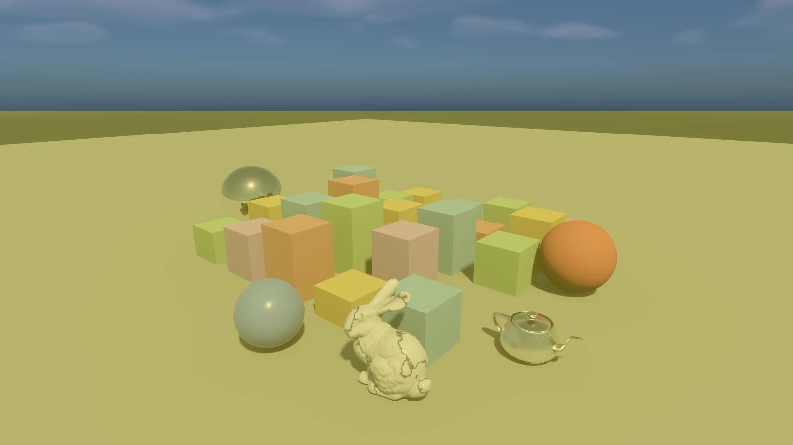

# frustracer

**A frustum tracer: beam tracing crossed with ray tracing.** The screen is a
quadtree, and empty space is proven empty *once per tile* instead of once per
pixel.


[](LICENSE)


One frustum covers the whole screen; it is traced forward until it *could* hit
geometry, that conservative distance is recorded, and the tile splits into 4
quadrants. Each child frustum inherits the parent's proven-empty distance and
starts there. Recursion bottoms out at small tiles, which trace ordinary
per-pixel rays with `tmin` set to the inherited distance. A tile whose frustum
intersects nothing is filled with sky immediately, **zero rays traced**.

Children also inherit a **node cut**: the parent's list of surviving BVH nodes,
re-culled and refined level by level, so a tile's frustum query descends the
parent's frontier instead of the BVH root, and leaf pixel rays seed their
traversal from the cut.

There is a full engineering write-up in the [technical appendix](#technical-appendix)
below — the algorithm, the correctness invariants, the measurements, and the
things that were tried and thrown away. The first half of this page is the
manual. If you mean to change something, read
[CONTRIBUTING.md](CONTRIBUTING.md) first (there is one Windows-specific trap
that will bite you silently).

---

## INSERT DISK ONE — build it and fly

```
git clone https://github.com/fechols/frustracer && cd frustracer
install-prerequisites.bat dxc          # the one component the default render mode needs
cargo run --release
```

That boots **THE WORLD**: seven curated benchmark scenes merged into one
34.4-million-triangle archipelago. Fly with **WASD**, look with the **left
mouse button**, and press **F1** for the heads-up display.

### What you need

| | |
|---|---|
| **OS** | Windows 10/11, x64. (The renderer is D3D12; there is no other backend.) |
| **Toolchain** | Rust (stable) + MSVC build tools & the Windows SDK — `build.rs` compiles three small C++ shims. CMake, because SDL3 builds from source. |
| **git-lfs** | Only if you want the scenes. `git lfs install` once per clone, or you get pointer files. |
| **GPU** | Anything D3D12. Ray tracing (tier 1.0+) unlocks `--dxr`, the default render mode; without it you fall back to the CPU tracer with a loud line, and it still works. |

**Building never needs any SDK.** The vendored headers are enough, and every
vendor library is `LoadLibrary`'d at runtime, so a bare checkout compiles and
passes the whole DLL-free gate suite. `install-prerequisites.bat` fetches the
optional runtimes (~700 MB for all of them) from each vendor's own release page.

### If you only have five minutes

No scene data, no SDKs, no waiting:

```
set GIT_LFS_SKIP_SMUDGE=1
git clone https://github.com/fechols/frustracer && cd frustracer
cargo run --release -- --no-world       # the procedural scene: boxes, spheres,
                                        # a marble bunny and a gold teapot
cargo run --release -- --check          # the test suite: headless, no DLLs, ~1 min
```

---

## YOUR MISSION — what this thing actually is

Most ray tracers ask the same question 2 million times a frame: *what does this
pixel see?* Almost every one of those queries spends its first few hundred
nanoseconds proving the same thing its neighbour just proved — that the first
several metres in front of the camera are empty air.

frustracer asks a cheaper question first. It takes the **whole screen** as one
frustum and asks *how far can I travel before I could possibly hit anything?*
That distance is inherited by four child tiles, which ask again, and again,
until the tiles are a few pixels across. By the time a real ray is fired, the
empty space in front of it has already been paid for — once, by an ancestor,
on behalf of thousands of pixels. A tile that provably sees nothing at all
becomes sky and fires **no rays whatsoever**.

That is the whole idea. Everything else in this repository is a consequence of
taking it seriously: what a conservative distance bound has to mean for the
answer to stay correct, how to keep it correct on a GPU, and what happens when
you point the same divide-and-conquer at the *light* integral instead of the
camera.


*A lap of the world, sunrise to moonlit night. Rendered with `--cinematic`;
the full 4K60 version is on the [releases page](../../releases).*

---

## THE SEVEN ISLES — one world, seven scenes, one lap of the day

The flagless boot merges every curated scene it can find into a single flat
scene under one sky, arranged as islands on a ring. The ring is **ordered by
hour**, so flying a lap sweeps the day from an industrial dawn to a moonlit
night — and flying *toward* an island eases the global clock toward that
island's own theme hour.

| # | Isle | Hour | Tris | What it is there to stress |
|---|---|---|---|---|
| 1 | **Powerplant** | 06:30 | 12.8 M | Raw geometric density — the classic worst case |
| 2 | **Sponza** | 08:30 | 0.26 M | The reference courtyard; glTF materials |
| 3 | **Rungholt** | 11:00 | 6.7 M | A whole Minecraft city: tiny triangles, wide open |
| 4 | **Damaged Helmet** | 13:00 | 15 k | All four glTF PBR map types at once |
| 5 | **San Miguel** | 15:30 | 10.0 M | Alpha-cutout foliage, glass, water, tinted shadows |
| 6 | **Bistro** | 17:30 | 2.8 M | Golden hour: 38 normal + 16 emissive maps |
| 7 | **Vokselia** | 22:00 | 1.9 M | Full night — moonlight, stars, fireflies |

<table>
<tr>
<td></td>
<td></td>
</tr>
<tr>
<td></td>
<td></td>
</tr>
<tr>
<td></td>
<td></td>
</tr>
<tr>
<td colspan="2"></td>
</tr>
</table>

A missing scene is not an error — it prints one line and the ring is built from
whatever is on disk. A fresh checkout with no LFS data falls back to the
procedural scene and says so.

```
cargo run --release                  # the world (the default)
cargo run --release -- --no-world    # the procedural scene instead
cargo run --release -- --tod 17.5    # start at a given hour; disarms the attractors
cargo run --release -- model.obj     # or just load your own OBJ / glTF / GLB
```

---

## FLIGHT CONTROLS

| Key | Pad | Action |
|---|---|---|
| **W A S D** / arrows | left stick | fly |
| **Q** / **E** | triggers | down / up |
| hold left mouse | right stick | look |
| **Shift** / **Ctrl** | bumpers | slower (÷8 / ÷16) |
| **,** / **.** | D-pad ← → | scrub time of day (1 hour per second) |
| **Esc** | Start | pause menu (Resume / Settings / Exit) |
| **F1** | | toggle the HUD |
| **F11** | | borderless fullscreen |
| **P** | | screenshot |

### Render modes and image quality

| Key | Action |
|---|---|
| **Space** | cycle render mode: CPU → GPU wavefront → DXR |
| **F** | jump straight between the CPU tracer and DXR |
| **G** / **K** / **X** | toggle the wired upscaler (DLSS-RR / FSR / XeSS) against plain |
| **N** / **M** | OIDN denoising; its temporal history |
| **J** | NPPD neural denoising |
| **U** | double samples per pixel (1 → 2 → … → 128 → 1) |
| **1 2 3** | quality presets |
| **H** | hemisphere bounces: off → AO → GI (still frames) |
| **V** | heightfield relief vs plain normal mapping (`--heightfield` sessions) |

### Debug

| Key | Action |
|---|---|
| **O** | quadtree overlay — subdivision-depth heatmap + tile borders |
| **R** | hybrid frustum tracer vs plain per-pixel (the A/B) |
| **T** | dynamic resolution vs fixed half-res while moving |
| **C** | verify the current view against a reference trace |
| **B** | GPU vs CPU tonemap |
| **Y** / **Z** | freeze the view's quadtree into the scene / clear it |

---

## THE OPTIONS SCREEN — HUD, pause menu, and saved settings

**F1** raises a heads-up display: a compass, the world clock, the live render
mode, an FPS graph (the violet band is frame-generation surplus), and a keymap
panel that fades in while you fly and out a couple of seconds after you stop.
An idle screen is clean; a faded HUD costs zero repaints.

**Esc** opens a pause menu with full settings pages. While it is open the
camera is frozen and the renderer stops tracing entirely — it re-presents the
last frame, so nothing accumulates and closing the menu needs no reset.

<table>
<tr>
<td></td>
<td></td>
</tr>
</table>

Settings are saved to `frustracer-settings.json` next to the executable. The
precedence rule is worth knowing: **compiled defaults < settings file < command
line**, by ordering alone. Live rows apply through the same code paths the
keyboard shortcuts use, so the menu and the keys can never disagree; rows that
can only be decided at startup are badged *restart*. Headless runs ignore the
file entirely — a gate has to be a pure function of its command line.

---

## POWER-UPS — what you can switch on

Everything here is on by default unless marked. Each has a kill switch, because
each one's A/B is how its cost was measured in the first place.

| Feature | Off switch | In-app |
|---|---|---|
| Volumetric clouds — a drifting, curl-warped slab that shadows the sun | `--no-clouds` | |
| Time of day, moon, and stars — the sun sets, the moon becomes the light, the star field lights the scene | `--tod <h>` to pin | **,** / **.** |
| Fireflies after dusk — real point lights with hard shadows | `--no-fireflies` | |
| Hemisphere-bounce GI / AO — the quadtree idea aimed at the light integral | (opt-in) | **H** |
| Heightfield relief — real displaced geometry at the intersector | (opt-in `--heightfield`) | **V** |
| The upscaler chain — DLSS-RR → FSR4-RR → XeSS → FSR 3.1, first supported wins | `--no-upscale` | **G** / **K** / **X** |
| Frame generation — four families, whichever the adapter supports | `--no-fg` | |
| HDR output — scRGB by default, HDR10/PQ where a wrapper needs it | `--no-hdr` | |
| Glare — the reason the sun looks like a sun | `--no-bloom` | |
| BC7 texture compression, encoded on the GPU at load | `--no-bc7` | |
| Per-island ambience + procedural wind | `--no-audio` | |

<table>
<tr>
<td><br><sub>clouds on (default)</sub></td>
<td><br><sub><code>--no-clouds</code></sub></td>
</tr>
</table>



*The **O** overlay, tinting each pixel by how its tile resolved. The blue band
is sky **proven empty and traced with zero rays**; the warm region is where
tiles reached the leaf level and fired real rays. (It needs the quadtree, so
it runs on the CPU or `--gpu` arm — `--dxr` traces from the TLAS root and has
no subdivision to show.)*

---

## THE CAMERA CREW — `--cinematic`

Every image on this page was rendered by the program itself, headlessly and
deterministically:

```
cargo run --release -- --cinematic list                    # the shot catalogue
cargo run --release -- --cinematic hero                    # one still, seconds
cargo run --release -- --cinematic islands                 # one still per isle
cargo run --release -- --cinematic tour --cinematic-frames 1200 --cinematic-fps 60 \
                        --cinematic-res 3840x2160 --cinematic-hdr
```

`--cinematic` renders stills and camera-spline sequences (closed-loop
Catmull-Rom, so a lap loops seamlessly), writes a numbered PNG sequence plus a
manifest, and prints the exact `ffmpeg` commands to encode it — HDR10 HEVC for
the release, an animated WebP for a README. `--cinematic-hdr` adds 16-bit
PQ/Rec.2020 frames, a linear OpenEXR master, and a properly tagged HDR AVIF.

It is not just a screenshot key. Because every output frame is a **static
pose** that accumulates N sub-frames, it is the only path in the tree that can
render a moving camera *with* hemisphere-bounce global illumination — the
interactive renderer can't, because that integrator is still-frames-only. And
with no upscaler available headlessly, all antialiasing comes from
accumulation, which for a still is better than what the window shows: converged
ground truth with no reconstruction artefacts.

---

## SECRET CODES

Real flags, all of them measured rather than guessed.

| Code | Effect |
|---|---|
| `--quinlight` | Wire **every** supported upscaler at once and present the Lucas-Kanade-registered, winsorized consensus of their outputs |
| `--dxr-inline 0\|1\|2` | How much of the DXR pipeline is recursive `TraceRay` vs inline `RayQuery`. See the appendix — this one changed the default |
| `--sw-rays` | Trace the wavefront's rays on our *own* BVH instead of the hardware's |
| `--spin path` | The deterministic benchmark: a closed camera loop, pose a pure function of frame index |
| `--stress 5000` | A procedural field of 5000 objects |
| `--tile 4x2` | Replicate a loaded scene into a grid — the 100-million-triangle path |
| `--bvh-builder sah\|lbvh\|ploc\|som` | Swap the BVH builder, including a self-organising-map "learned space-filling curve" (it loses) |
| `--spp 16` | Samples per pixel per frame; the quadtree is traced once regardless |
| `--check`, `--check-gpu`, `--check-dxr` | The test suite (see below) |
| `--gpu-timing` | Per-pass GPU milliseconds, every vendor — the only per-pass profiler that works on Arc |
| `FRUSTRACER_STAB=1` | Print inter-frame stability of the presented image |
| `FRUSTRACER_HUD_STATS=1` | Dirty-rect accounting for the HUD, plus a ground-truth buffer dump |

### `--check` is the test suite

There are no unit tests. `--check` renders a frame, re-traces **every pixel**
with a `tmin = 0` reference ray, and exits nonzero unless the false-sky and
tmin-overshoot counters are exactly zero — then does it again through the
depth-capped driver, the temporal cache, the replay path, the bounce
integrators, and about twenty pure-math module self-tests. It needs no GPU and
no DLLs. `--check-gpu` and `--check-dxr` carry the same contracts onto the two
GPU pipelines.

---

## TROUBLESHOOTING

**It says "dxr: falling back to CPU tracing".** DXC is missing — run
`install-prerequisites.bat dxc`. Everything still works, just on the CPU.

**The scenes are 1 KB text files.** That is git-lfs. `git lfs install`, then
`git lfs pull`.

**The world didn't load.** It prints one line per missing island. Without any
of them it falls back to the procedural scene, which is fine.

**Builds are slow.** Exclude `target/` from Windows Defender — every link
writes ~50 MB past the real-time scanner:
`Add-MpPreference -ExclusionPath '<repo>\target'`. Use `--profile quick` to
iterate (a one-line touch is ~25 s instead of ~45 s), but **never benchmark
under it** — every number this project reports assumes `release`'s LTO
settings.

**`--fsr4` exits with code 2.** That is deliberate: `--fsr4` *requires* FSR4 +
Ray Regeneration (RDNA4). It tells you why and what to try instead. Use
`--fsr` if you want it to fall through.

**A binary I built elsewhere crashes.** `.cargo/config.toml` sets
`-C target-cpu=native`. Build with `-C target-cpu=x86-64-v3` to distribute.

---

## THE FINE PRINT

**This is a non-commercial research and educational project.** It is not sold,
it carries no advertising, and nothing here is offered as a product. The
benchmark scenes under `scenes/` are redistributed for that purpose — they are
the standard research assets this kind of renderer is measured against, and
they come from archives that publish them to the research community for exactly
this use. Each scene keeps its own licence and credit file, and the required
attribution is stated there.

> **Rights holders:** if you own any asset here and would prefer it not be
> redistributed, open an issue (or email the address in the repo owner's
> profile) and it will be removed promptly, no argument. The renderer already
> degrades gracefully without any given scene — a missing island prints one
> line and the world is simply smaller.

The **source** is [MIT](LICENSE). The scenes are not: each carries its own
licence — several are non-commercial, several require attribution, and one
(`scenes/sponza-khronos/`) is a proprietary CryEngine agreement rather than a
Creative Commons one. The vendor SDKs are downloaded from their owners rather
than redistributed here. See [LICENSE](LICENSE) for the full scope.

Scenes from the [McGuire Computer Graphics Archive](https://casual-effects.com/data/),
the [Khronos glTF sample assets](https://github.com/KhronosGroup/glTF-Sample-Assets),
and Amazon Lumberyard. Ambience is CC0. Slint is used under its Royalty-Free
licence. The Stanford bunny and the Utah teapot are where they always are.

**Intel Sponza is referenced but not shipped.** Several measurements in the
appendix were taken on it, and it is still supported as a scene argument — but
its terms grant personal and educational use rather than redistribution, so it
is not in this repository. Download it from
[Intel's graphics-research samples](https://www.intel.com/content/www/us/en/developer/topic-technology/graphics-research/samples.html)
and extract to `scenes/intel-sponza/` if you want to reproduce those numbers.

---
---

# TECHNICAL APPENDIX

The manual is over. What follows is the engineering write-up: how it works,
what was measured, and what was tried and removed.

## The developer's notebook — `CLAUDE.md`

`CLAUDE.md` at the repository root is the real design document — around 400 KB
of it, organised by subsystem. It records *why* each decision was made, what
was measured, and what was tried and thrown away, and it is written for
whoever, or whatever, edits the code next.

It is too large to browse blind. The useful entry points are `## Commands` (the
complete flag reference, with the reasoning behind each default), `##
Correctness invariants (the bug class to guard)` (the rules that must not
break), and `## Architecture notes` (the module map). Each subsystem then has
its own section.

## Why a BVH for the scene?

The frustum query needs two things from the spatial structure: a cheap
"is this region outside the frustum?" test, and a cheap conservative
"nearest possible distance" bound. A **BVH of AABBs** gives both — the
classic positive-vertex plane test for culling, and point-to-box distance
for the bound. BSP/KD-trees are worse here: their splitting planes don't
yield a cheap conservative nearest-hit distance along the beam.

## The correctness crux

The distance recorded by a parent is the Euclidean distance from the camera
origin, so the region it proves empty is *frustum ∩ ball(origin, t)* — a
**spherical** bound, not a planar near clip. The query
(`src/frustum.rs::nearest_geometry_distance`) therefore culls a node as
"already proven empty" only when its whole box lies inside that ball, and
clamps candidates up to the inherited distance. Mixing in a flat near plane
would over-cull near frustum corners and let child rays start past real
geometry. Secondary rays (shadow / AO / reflection) never see the inherited
`tmin` — it is a primary-frustum property only.

The node cut obeys the same discipline: `refine_cut` may drop a node only if
it is fully outside the tile frustum or fully inside the proven-empty ball —
**never** by distance-to-best pruning (a far node can still be the nearest
thing in a sibling's frustum; pruning it would surface as false sky). When the
`MAX_CUT` budget runs out, internal nodes are emitted coarsely, never dropped.

`frustracer --check` verifies this directly: it renders one hybrid frame,
re-traces every pixel with a `tmin = 0` reference ray, and requires the
**false-sky** and **tmin-overshoot** counters to be exactly zero — at full
depth and again through the depth-capped driver (coarse flat-filled pixels are
excluded from the comparison but must exist, so the capped path is provably
exercised).

## Hemisphere bounces: the same idea, aimed at the light integral

Secondary lighting is an integral of incoming light over the hemisphere above
each shading point — and the same divide-and-conquer that drives the screen
quadtree can dispatch that search (**H** cycles it: off → AO → GI; still frames
only).

The hemisphere is a quadtree too, but built from **spherical triangles**
instead of squares: the root is the tangent half-space (a 1-plane frustum),
level 1 is 4 spherical octants, and deeper levels split each triangle through
its great-circle edge midpoints. Great-circle edges are exactly planes through
the apex, so every cell *is* a `TileFrustum` (3 planes + unused slots), the
midpoint children exactly partition their parent (which is what makes
inherited `tmin` + node cuts sound, the same argument as pixel quadrants), and
each cell has a closed-form cosine-weighted area (Lambert's formula — an
octant is exactly π/4). The apex is the shading point; the hemisphere runs its
own tmin chain from its own apex — the primary tile's `tmin` never leaks in.

Each cell runs the familiar step: bound query over the inherited cut, then

- **proven empty** → the cell's contribution is *analytic*: exact projected
  solid angle for AO, `sky() ×` exact PSA for GI (with pure-math refinement
  near the sun's glow lobe — an empty parent proves all children empty, so
  refining costs sky evaluations only). Zero rays, zero variance.
- **query cutoff reached** → one stratified ray per sub-cell (uniform inside
  the spherical triangle, Arvo '95), seeded from the inherited cut with the
  inherited `tmin` — the hemisphere analog of `LEAF_TILE`: one bound query
  amortizes over 4 rays, because an occlusion ray is ~10 node visits and a
  bound query on a dense cut costs more.
- otherwise → refine the cut, split 4-way, recurse (blocked cells subdivide,
  never stop — same rule as the screen).

AO additionally clamps every query to the AO radius (`None` then means "open
within the radius", never "sky") and drops cut nodes entirely beyond it —
sound only because every consumer ray's `tmax` is clamped the same way.

Verification mirrors the primary gates: every claimed-empty cell is re-tested
with reference rays through its interior (**false-empty = 0**), every leaf
ray is re-traced with `tmin = 0` (**tmin-overshoot = 0**), cut-seeded
traversal must agree with the full tree, and the accounted projected solid
angle per point must total π. On top of that, `--check` A/Bs the integrator
against high-sample cosine references: AO within 0.02 mean absolute error and
bias-free (the estimator is unbiased — the leaf samples are uniform in their
cells); GI within 5% mean relative against a reference implementing the same
one-bounce policy.

The measured economics are honest rather than triumphant: a hemi-GI frame
costs ~40-60× a plain hybrid frame at 64 cells/point on the dense default
scene — but it is *converged* immediately where the sampled path needs
hundreds of accumulation frames, and open scenes adapt (most of the
hemisphere resolves analytically at octant scale).

**Shadow shafts** (removed) applied the same machinery to the light: a frustum
from the shading point through the *rectangular* light's corners, subdivided
once on ambiguity, so samples landing in a subrect proven empty skipped their
occlusion ray outright — same sampling, same estimator, identical image; 75% of
shadow rays vanished on the default scene. The candid result was that at 2–4
shadow samples/point the culling query cost more than the rays it saved (~3× net
slower). It is gone now for a second reason: its whole premise was a *finite
rectangle with four corners*, and the light is a sun disc at infinity. Same
economics killed a specular-bounce cone accelerator — one query costs more than
one ray's traversal.

## The lighting model: one sky, split by frequency

The **environment** is a single light: a sky sphere at infinity, of which the
sun is a bright patch. It is *stored* in two representations, and the split is
by frequency, because the two bands need different sampling strategies:

| band | representation | sampled how |
|---|---|---|
| scattering dome (smooth — Rayleigh + Mie) | order-2 SH, 9 RGB coefficients | analytic irradiance, **zero rays** |
| sun disc (sharp) | direction + angular radius + radiance | cone-sampled, **shadow-rayed** |

This is forced, not stylistic. Spherical harmonics have **no notion of
visibility** — you cannot cast a shadow ray at a coefficient — and a 2° sun
occupies ~0.01% of the hemisphere, so gathering it by cosine sampling is pure
noise. Conversely, irradiance is a convolution of radiance with a clamped-cosine
kernel whose own spectrum collapses above l = 2, so 9 coefficients carry >99% of
what a Lambertian surface can see. Each representation is doing the job the other
physically cannot. (This is why renderers with full HDR environment maps *still*
keep an explicit sun: to importance-sample the bright region, you need it as a
separable object.)

**The invariant that keeps it honest: the sun disc is delivered exactly once per
light path.** A ray sees the disc only if no light-sampling strategy already
covers the sun along that path — the camera's own miss and refraction through
glass see it (nothing else delivers it there); every *gather* path (the
hemisphere integrator's cells, GI bounce misses, the SH projection itself)
integrates the **sun-free dome**, because the direct-lighting loop already
delivered the sun with its own shadow ray. The specular reflection ray is the one
path both strategies can reach, so it takes the dome plus a **MIS-weighted** disc
(balance heuristic; zero extra rays, zero extra random draws). Get the gather
paths wrong and you double-count the sun *and* fire fireflies into the
hemisphere's fixed-point accumulator.

It also rescues the hemisphere integrator: its empty cells are evaluated by
*centroid point-sampling*, so a cell coarser than the sun would either miss the
disc entirely or splat the whole cell at sun radiance. Excluding the disc removes
the sharp feature outright — the frequency split isn't a convenience, it's what
makes the analytic path correct.

Two later additions extend that model without weakening the invariant. After
sunset **the one disc becomes the moon** (the same `Sun` struct at the
antipodal direction, so shadows, MIS and the dome tint all keep working), and
the **star field lights the scene**: the points you see are display-only, but
the field's smooth analytic mean is delivered to every gather path, so night
has an ambient floor that does not depend on the moon's elevation. Same rule,
one representation to the eye and another to the gathers, with the energy
matched between them.

The **fireflies** are the documented exception, and they are exceptions in the
opposite direction. They are genuine point lights — up to 64 of them, windowed
`1/d²`, each with its own hard shadow ray — so the scene after dusk is no
longer lit by the environment alone. What keeps the invariant intact is that
they are excluded from *every* gather path: the SH projection, the hemisphere
cells, the GI bounce misses and both reference estimators all pass no
fireflies. Direct lighting already delivers them with a shadow ray, so a gather
that also saw them would double-count — the same argument as the sun, applied
to a local light.

The renderer previously had *two* suns that disagreed: a soft `dot^32` glow in
the sky (a backdrop, too bright to be a light) and, separately, a 4×4 rectangular
lamp 12 units away with `1/d²` falloff that actually lit the scene. Mirrors
exposed the seam — the "sun" reflected as a **square**, because a specular
highlight is an image of the light's shape. It is a round disc now, and it is the
same sun that casts the shadows. A pleasing check: the ambient the physical
Rayleigh sky produces, (0.120, 0.176, 0.247), lands within a few percent of the
hand-tuned constant it replaced — the old guess was a good one, and it is now
*derived*.

### Glare, and why the sun is not the thing that needed fixing

Looking straight at the sun, the disc first rendered as a flat white circle
stamped on the aureole — a hard ring where the two met. The tempting fix is to
soften the sun. That would be wrong: the solar limb *is* a hard edge, a ~650×
radiance step, and the tonemap saturates above radiance ~5, so the disc lands at
a dead-flat 1.0 no matter what shape you give it.

Photographs and eyes don't show that ring, and the reason isn't the sun — it's
the **optics in between**. Light scatters in the lens, the cornea, the vitreous,
so a point source lands on the sensor as a bright core inside a wide,
heavy-tailed halo. That's what makes a sun look like a sun, and it belongs at the
display stage, not in the sky.

So `src/bloom.rs` models the scatter: a mip pyramid whose octave-spaced blurs sum
into the heavy tail a single Gaussian can't produce, folded back with a 3×3 tent
(a plain bilinear tap leaves the box kernel's *square* footprint visible in the
core — the glare comes out as a rounded rectangle, which is very obvious on the
one thing the pass exists for). The composite is **energy-conserving** —
`(1-s)·hdr + s·glare`, not `hdr + glare` — because glare *redistributes* light
rather than creating it. A uniformly lit frame must come back unchanged, which is
the gate, and it also means bloom can never be accidentally tuned into an
exposure change.

It runs on whatever image the tonemap is about to read, so it never touches
`accum`, the temporal cache, or any upscaler guide — every radiance gate in the
suite is structurally blind to it.

## Parallelism

Rayon's work-stealing pool is the "task list + pool of listener threads":
each quadrant split is a recursive `rayon::join` (small tiles recurse
sequentially for granularity). The framebuffer is a `Vec<AtomicU32>` of
f32-bit linear RGB with relaxed stores — tile writes are disjoint, so this is
the idiomatic safe shared buffer.

## Build times, and the `quick` profile

`.cargo/config.toml` links with **`rust-lld`** (LLVM's LLD in its `link.exe`-compatible
COFF mode). It ships inside the rustup toolchain, so there is nothing to install
and no new prerequisite.

(**mold is not an option on Windows** — it is an ELF linker and cannot produce a PE
binary. The question keeps coming up; `rust-lld` is the answer.)

The linker is not the bottleneck, though — the `release` profile's whole-program
LTO pass is. `release` is `lto = "thin"` + `codegen-units = 16`; the 16 was a 1
until 2026-07-23, which serialised ThinLTO into a fat-LTO-shaped single pass. A
one-line touch of `main.rs` went **198 s → 45 s** when it changed, at a measured
cost of **+1–2% CPU-tracer ms/frame** — which means CPU benchmark numbers
recorded before that date carry that offset, including some quoted below.
`[profile.quick]` (`lto = false`) takes the same touch to ~25 s.

> **Never benchmark under `quick`.** Every performance number this project reports —
> the `--check` A/B bench rows, the hemi-share kill criterion, the adopt on/off
> regression guards — is only meaningful under `release`'s `lto`/`codegen-units`
> settings. Use `quick` to find compile errors and to exercise the exact-zero
> correctness gates (which are perf-independent); use `--release` for anything that
> prints a number.

## Dynamic resolution (60 FPS target)

While the camera moves, each frame targets a time budget (~15 ms render +
resolve/present headroom ≈ 60 FPS). The budget is not a per-tile deadline:
a controller converts the *previous* frame's measured time into a **uniform
quadtree depth cap** for the next frame, and the same depth-first recursion as
the normal driver runs everywhere to that cap. Tiles reaching it unresolved
become one flat quad — the color of a single representative ray through their
center, starting at the tile's inherited distance. A uniform cap means no
screen corner gets refined at another's expense (the failure mode that a
wall-clock deadline on a depth-first traversal would have), so the recursion
keeps its cache-friendly shape: node cuts live on the recursion stack, hot in
cache, instead of a materialized breadth-first frontier of 256-byte tiles.
Zero clock reads in the driver — a frame is deterministic for a given cap.

The controller works in log space: cost roughly quadruples per level, so
`log4(budget / elapsed)` reads "levels of headroom" directly. A fractional
depth accumulator moves by `0.6 ×` that error, clamped to creep up slowly
(≤ 0.4/frame) but drop more than a full level after a blown frame, within
`[2, depth_full]`; a deadband stops it climbing when a frame already uses
> 60 % of the budget (the next level costs ~4×). At the top of the range the
cap reaches leaf tiles and a "budget" frame is simply a full hybrid frame.
The trade-off of having no in-frame deadline: a hard cut to much denser
geometry can blow one frame past budget before the controller reacts on the
next. Resolution floats with scene and shading cost instead of frame time:
crank the quality preset and tiles get coarser, not slower. The overlay tints
these depth-capped quads orange — uniform quad size is the visible signature
of the cap. When the camera stops, jittered samples accumulate (up to 1024
spp) so soft shadows, AO, and antialiasing converge at full resolution. **T**
falls back to the old fixed half-res moving mode for comparison.

Per-second stats on stderr show the frustum counters: queries, node visits
(frustum + ray), mean node-cut length, sky pixels resolved with zero rays,
coarse pixels, and mean `t_start / t_hit` (how much empty space the quadtree
skipped before each pixel ray even started).

## Deferred material-sorted shading (--defer-shade): a candid negative result

The idea: the quadtree already visits the screen depth-first, so let leaf
tiles trace their pixels but *defer* shading, merge same-material runs on the
way back up (whole-segment pointer moves, capped at a 64×64 maximum shading
tile for load balance), and flush each macro-tile with its segments
stable-sorted by material — a "tiled shader" where one material's textures
stay cache-hot for a whole burst instead of being evicted at every 8×8
boundary. The plumbing is exact: each record carries its pixel's RNG state,
`dir`/`ray` are recomputed bit-identically from the frame camera, and the
flush replays `shade()` verbatim — `--check` on any textured scene gates
defer-off vs defer-on **bit-identity** of color/t/info (0 px differ), so the
reorder provably changes nothing but timing.

Measured (7950X3D, 1080p `--spin path`, 200 frames): default procedural scene
22.7 → 22.7 ms (untextured materials shade inline — the machinery
structurally disengages), Vokselia 22.5 → 23.0, San Miguel interior 7.74 →
7.75 with 12% of pixels deferring in mean-400 px bursts, Intel Sponza (2.7 GB
of 4K textures, 23% of pixels deferring) 36.9 → **41.2 ms** — the more
texture traffic, the more the staging costs, and nowhere a win. Two earlier
implementation lessons are baked into the code: merging by `Vec::append`
re-copied every record per level (~GB/frame, 3× frame time) — segments fixed
that; and flushing a 4096-px bucket sequentially made every macro-tile an
end-of-frame straggler on one core (+29% on Sponza) — the flush now re-splits
across rayon at the fused path's 1024-px grain.

Why it can't win: at 1 spp, adjacent pixels' bilinear footprints are
essentially disjoint, so each texture cache line is touched about once per
frame *regardless of shading order* — material sorting optimizes the order of
a stream that has no reuse to exploit (and a 128 MB V-Cache absorbs much of
what little there is). Mips were the obvious suspect for creating that reuse,
so they were built next (below) and the A/B was rerun: **still no win** — San
Miguel interior 7.49 → 8.89 ms, Intel Sponza 32.6 → 38.8. Mips shrink the
*working set*, which helps the fused path just as much; they don't manufacture
inter-pixel reuse that a reorder could newly exploit. The feature stays
off-by-default behind `--defer-shade`, gates and `defer:` counters intact.

## Mip-mapping, trilinear, and 16× anisotropic filtering

Textures are sampled trilinear with a **ray-cone LOD** (Möller 2019,
curvature-free), on all three renderers — CPU, the `--gpu` wavefront, and
`--dxr`. Cone width grows along the ray (`w0 + t·spread`, primary spread = one
pixel's angular size); the LOD adds the triangle's texel density
(`0.5·log2(uv_area/world_area)`, computed on the fly from the hit's vertices —
a cached per-tri array would cost ~400 MB at 100M-tri tiling scale), the map's
dimensions, and a grazing-angle term. Reflection and glass continuations
inherit the parent hit's cone width; hemisphere-GI bounce hits read a fixed
broad footprint (over-blurred bounce albedo is variance reduction, never
error).

The chain is generated once on the CPU (2×2 box filter to 1×1) and uploaded to
the GPU verbatim, so the renderers' long-standing parity axiom is *upgraded*
rather than broken: identical texels at identical LODs, and the GPU-vs-CPU
albedo gate (mean |Δ| ≤ 0.02/channel) now compares trilinear against trilinear
— measuring 0.0000/channel on San Miguel, with no tolerance widened. Two
details are load-bearing. The filter runs in **linear space** (sRGB texels
decode, average, re-encode) — a gamma-space box filter darkens mid-tones, and
the self-test's 2×2-checker case rejects it. And **alpha cutout never sees
mips**: it stays nearest-texel at level 0 on every path, because that test is
*visibility*, and CPU/RayQuery/DXR agreeing on it bit-for-bit is a correctness
contract.

`lod ≤ 0` reproduces the old bilinear sampler bit-exactly, so magnified views
— and every existing tolerance gate — are unmoved by the feature. `--no-mips`
is the A/B lever. Measured (1080p `--spin path`, 7950X3D): mips are *faster*,
Intel Sponza 34.7 → 32.6 ms and San Miguel interior 7.7 → 7.5 (fewer
DRAM-miss taps under minification more than pays for the extra tap), at +33%
texture memory. Aliasing goes with them: `FRUSTRACER_STAB=1` on a still XeSS
Sponza view reads 0.65 → 0.57 /255 of inter-frame shimmer.

### Anisotropy (`--aniso N`, default 16)

A ray cone is a *circle*, but the surface it lands on sees an *ellipse*:
projected along the ray, the footprint is `cone_w` across the direction of
travel and `cone_w / |n·d|` along it. One scalar LOD can only describe a
circle, so the formula above covers the **major** axis and blurs the minor one
with it — its `− log2(max(|n·d|, 0.05))` term *is* that compromise, and it is
why trilinear mushes distant floors and long walls. Anisotropy is therefore not
a rival filter here but the same footprint kept honest: `tri_grads` returns both
axes as normalized-UV gradients (Cramer's rule against the triangle's UV basis
— the on-the-fly `∂P/∂u, ∂P/∂v` the normal-mapping tangent frame already
derived, now shared), the CPU averages up to 16 trilinear taps along the major
axis at the *minor* axis's LOD, and the GPU hands the identical gradients to
hardware `SampleGrad` on an anisotropic sampler. That the two paths are one
formula is gated, not asserted: on a conformal UV map the major axis in texels
must equal the old isotropic LOD to 1e-4.

Worth knowing if you go looking for this in the code: **`SampleLevel` cannot be
anisotropic.** It hands the TMU one scalar LOD and no gradients, so switching
the sampler to `ANISOTROPIC` while still calling `SampleLevel` would have been
a silent no-op — the gradients are the whole feature. Hemisphere-GI bounce rays
deliberately stay isotropic (their cone is octant-coarse by design; 16 taps
would buy nothing).

`--aniso 1` (= `--no-aniso`) runs the isotropic path *verbatim*, so it is
bit-identical to the pre-anisotropy renderer by construction — which makes the
whole check suite re-run under it the regression proof. Hardware aniso and the
CPU's N-tap approximation use different tap distributions, so they were never
going to agree exactly; the GPU-vs-CPU albedo gate measures **0.0001/channel
against its unchanged 0.02 limit**. Cost is pose-dependent and real on the CPU
(16 taps where the footprint is 16:1): Intel Sponza 24.1 → 26.3 ms (+8.7%), San
Miguel interior 16.0 → 16.1 (+1.1%); `--aniso 4|8` buys that back. On the GPU
it disappears under the bench row's own noise.

## Where DXR's time actually goes: a three-point ablation

The `--dxr` pipeline and the `--gpu` wavefront trace the same rays with the
same pasted shading code; only the dispatch shape differs — recursive
`TraceRay` through a shader binding table versus inline `RayQuery` in
compute. On an Arc Pro B70 that difference read as "DispatchRays is 5×
slower than the wavefront," which is the kind of claim that deserves a
decomposition rather than a vibe. `--dxr-inline 0|1|2` is that
decomposition: mode 1 keeps the primary
TraceRay → closest-hit but compiles the inline-RayQuery trace primitives in
place of the TraceRay flavors, so every secondary ray (shadow, AO,
reflection, the glass chain) runs inline *inside the hit shader*; mode 2
goes all-inline in raygen — no TraceRay anywhere, DispatchRays reduced to a
bare launch grid over the reference loop. Every mode passes the full
`--check-dxr` suite with statistics identical to the shipping pipeline
(same hardware traversal, same shading), so the A/B is dispatch and nothing
else.

| `--spin path` 1080p, spp=1, tracer ms | all TraceRay | inline secondaries | all inline | wavefront |
|---|---|---|---|---|
| B70 default | 9.05 | 2.35 | 1.41 | 1.76 |
| B70 `--stress 5000` | 5.30 | 1.64 | 1.22 | 2.02 |
| B70 San Miguel low-poly | 6.75 | 1.94 | 1.29 | 2.05 |
| 4090 default | 1.34 | 0.26 | 0.29 | 2.09 |
| 4090 `--stress 5000` | 0.79 | 0.25 | 0.27 | 1.08 |
| 4090 San Miguel low-poly | 1.18 | 0.34 | 0.34 | 1.00 |

**Arc executes DispatchRays and inline RayQuery just fine; what it hates is
re-entering the scheduler from a hit shader.** Recursive TraceRay
secondaries multiply the tracer 4.4–6.4× on the B70 — and this is not an
Arc quirk but a cross-vendor property: the 4090 pays 3.0–4.6× on the same
scenes. Arc's penalty is ~1.4–1.5× NVIDIA's, and it lands on top of a
weaker RT-core baseline; the two *compound* into the 5× that started the
investigation. DispatchRays launch overhead itself is ≈ zero — mode 2 lands
at the compute reference kernel's own cost on both vendors.

Two riders worth keeping. The primary ray is the one place TraceRay earns
anything: on the 4090, mode 1 beats mode 2 (a coherent primary on the
hardware pipeline is worth a few percent), while the B70 always prefers
zero TraceRay. And mode 1's *marginal sample* on the B70 is 2.2 ms against
mode 2's 1.11 — the candidate-loop-fattened closest-hit shader pays
occupancy per sample where the all-TraceRay pipeline paid per dispatch, so
a fat hit shader is fine at 1 spp and ruinous at 16. The spp sweep also
places the wavefront: on the B70 the all-inline DXR only beats the quadtree
below ~3 spp (the quadtree's marginal sample is 0.86 ms vs the
reference-shaped 1.11), while on the 4090 inline DXR wins at every spp
measured.

The measurement became the default: **mode 1 now ships as the DXR
pipeline's dispatch mode** — it strictly dominates the all-TraceRay build
at every measured (vendor, scene, spp) point while keeping the payload /
closest-hit / SBT machinery doing its real job for the primary ray.
`--dxr-inline 0` is the A/B escape back to the by-the-book pipeline, and
`--dxr-inline 2` remains the right manual pick for a high-spp Intel DXR
session. The numbers were the product; the default is the dividend.

## What the quadtree is actually worth

Worth stating plainly, because the framing invites overclaiming. The published
0.87–0.93× Intel and 1.31–1.37× NVIDIA marginal ratios were measured with the
old `(LEAF_TILE, LEAF_GROUP) = (8, 32)` frontier. The shipping frontier is now
`(32, 256)`, and the timing instrumentation that produced the old table was
subsequently found to include uneven asynchronous-compilation bias. Those
ratios—and the old ~16-spp Intel crossover—are historical results, not current
claims. A new cross-vendor sweep is required before quoting replacements.

One conclusion survived every ablation: tightening the inherited distance
changed ray traversal very little. Setting leaf `t_start` to zero cost only
1.1–1.7% on the measured Intel runs and straddled zero on a 4090. Most of the
useful work was **tiles proven empty tracing no rays at all**. The valuable
product is the shared empty-space proof (and, for custom traversal, the
inherited node frontier), not physical ray length.

## Future work

Cut-aware leaf ordering (sort the cut by distance once per leaf tile so all 64
rays shrink `tmax` early), and adapting the frame budget from measured
resolve/present cost.
