# frustracer

**A frustum tracer: beam tracing crossed with ray tracing.** The screen is a
quadtree, and empty space is proven empty *once per tile* instead of once per
pixel.

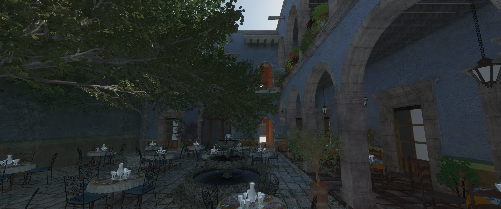

[](https://github.com/fechols/frustracer/actions/workflows/ci.yml)
[](LICENSE)


One frustum covers the whole screen; it is traced forward until it *could* hit
geometry, that conservative distance is recorded, and the tile splits into 4
quadrants. Each child frustum inherits the parent's proven-empty distance and
starts there. Recursion bottoms out at small tiles, which trace ordinary
per-pixel rays with `tmin` set to the inherited distance. A tile whose frustum
intersects nothing is filled with sky immediately, **zero rays traced**.

Children also inherit a **node cut**: the parent's list of surviving BVH nodes,
re-culled and refined level by level, so a tile's frustum query descends the
parent's frontier instead of the BVH root. CPU and `--continuation-rays` leaf
rays also seed their traversal from that cut. Default hardware
[`RayQuery`](https://microsoft.github.io/DirectX-Specs/d3d/Raytracing.html#inline-raytracing)
leaf rays cannot accept an arbitrary BVH frontier, so they restart at the TLAS
root and consume only the inherited `tmin`.

Lighting is **real-time ray-traced global illumination**: one cosine-sampled
bounce ray per pixel per frame, in all three render modes, with real emissive
transport — bounce hits carry what they emit. Cosine importance sampling makes
that one sample the irradiance estimate directly, so the temporal
denoisers/upscalers converge it at 1 spp under motion, and a still frame can
additionally switch to the converged hemisphere integrator (**H**).

### Result so far

This is a research prototype, not a claim that a quadtree universally beats
hardware root traversal. The durable result is more specific:

- proving a whole tile empty is valuable because it eliminates every ray in
  that tile;
- an inherited BVH cut can help custom software traversal;
- merely increasing a hardware ray's `tmin` changes traversal cost very little.

A July 2026 Arc Pro B70 pass at 1080p measured the moving procedural workload at
0.74 ms/frame for the plain hardware-RayQuery reference and 1.07–1.08 ms/frame
for the original quadtree hybrid. Removing terminal cut refinement that hardware
rays could not consume reduced materialized cut records from 257 to 65; batching
homogeneous child-queue reservations removed more global atomics. Together they
reduced the hybrid to 1.02–1.03 ms—about 5% across these laps—without changing
a pixel or visibility counter. These are engineering A/Bs over deterministic
camera laps after a 1,600-frame Intel shader warm-up, not publication-grade
cross-vendor results.

### Relation to prior work

The closest antecedent **structurally** is Teller and Alex's 1998 MIT technical
report **Frustum Casting for Arbitrary Polyhedral Environments**
([in-repo copy](docs/papers/MIT-LCS-TR-740.pdf)), whose frustum descriptor —
a shared point of view, four extreme rays, and four bounding planes — is the
same object as this renderer's `TileFrustum`, subdivided by the same screen
quadtree. Reshetov, Soupikov, and Hurley's 2005 Intel paper **Multi-Level Ray
Tracing Algorithm**
([in-repo copy](docs/papers/mlrta105.pdf) ·
[publisher](https://dl.acm.org/doi/10.1145/1073204.1073329) ·
[public PDF](https://www.eng.utah.edu/~cs6965/papers/p1176-reshetov.pdf))
contributes the other half: a **deep hierarchy entry point** found by descending
with the beam. frustracer's cut is a strengthening of that entry point — an
antichain of surviving nodes (~10 in practice) rather than the single node an
MLRTA bifurcation stack yields. Later work includes [Traversing a BVH Cut to
Exploit Ray Coherence](https://www.scitepress.org/PublishedPapers/2011/33634/)
and [Faster Ray Tracing through Hierarchy Cut
Code](https://diglib.eg.org/items/960d265d-7380-4fcf-aaf9-fd428fa0aeef).
frustracer's contribution is a modern D3D12/DXR implementation and an explicit
measurement of which products of the shared probe—empty tiles, `tmin`, and
inherited cuts—actually pay on current hardware.

That measurement now extends to the papers' own remaining ideas, and the
result is mostly negative — which is the useful part. Teller's covering test
(§4 opt 2) fires on 19.7% of San Miguel's pixels but is worth ~0.7% of frame
time; his straddle-mask inheritance (§4 opt 3), MLRTA's Kay–Kajiya interval
reject, and MLRTA's adaptive tile termination all optimize the frustum ladder,
which is **0.22% of CPU node visits** on all three test scenes and 0% of a
resting GPU frame (structure replay deletes it). Teller's frustum advance is
structurally unavailable: it needs cell adjacency, which a BVH does not carry.
See `src/oracle.rs` for the harness these came from.

### Software prototype of a hardware traversal continuation

`--continuation-rays` is an executable sketch of an RT API that does not exist
yet. Conceptually, that API has two operations:

```text
TraversalFrontier ProbeBeam(AccelerationStructure, beam, parent_frontier)
Hit TraceFromFrontier(AccelerationStructure, frontier, ray, tmin, tmax)
```

The wavefront quadtree is the producer. When a tile reaches its terminal size,
it publishes one 64-bit, provider-cookie-tagged `TraversalFrontier`. The leaf
shader cannot inspect a node ID, pool slot, or frontier length; it can only
hand the token to `trace_closest_frontier`. The current provider decodes the
token and walks frustracer's software BVH from every surviving subtree. Every
pixel and every SPP sample in that tile reuses the same token. An invalid token,
an exhausted arena, or an unavailable provider falls back conservatively to
the root.

This is a **semantic prototype**, not emulation of a vendor RT core's private
stack and not a speed claim. Software traversal is expected to lose to current
fixed-function traversal on many scenes. What it demonstrates is the contract
a future native implementation would need:

- the handle is opaque, immutable, forkable, and reusable by many rays;
- it is valid only for the same AS build, visibility domain, producing beam,
  and certified distance interval;
- `t_start` remains separate, because the empty-space proof is still valid
  when a frontier coarsens to an ancestor or root;
- capacity pressure may return an ancestor/root handle, but may never drop a
  candidate or turn overflow into “sky”;
- exact-basis replay may retain handles; a new producing pass or AS rebuild
  invalidates them.

The first B70 software-vs-software ABBA (July 26) read the frontier arm ahead —
root 1.90–1.91 wall / 1.739 span / 1.393–1.394 leaf against 1.85 / 1.683 /
1.302–1.303, about 6.5% off the direct ray consumer and 3.2% off the GPU frame.
**A re-run of the identical protocol on the August 1 tree retires that
margin.** At 1080p/SPP=1 on the moving procedural path (1,600 warm-up + 600
measured frames, fresh process per run, root/frontier/frontier/root order),
the two arms agree window-by-window to ±0.004 ms across the whole camera lap —
statistically identical — while both run ~7–11% faster than the July numbers
(the wave-aggregated queue atomics and later leaf-kernel restructurings landed
in between and moved both arms). The frontier is provably still doing its job
— the same day's `--check-gpu --continuation-rays` reads 768/768 non-root
handles at 468.8 rays reused per handle, zero root fallbacks — the reused
traversal state just no longer buys measurable time on this workload. The
honest surviving claims are architectural: the opaque handle seam works, the
conservative fallbacks hold, and the images stay bit-identical; "traversal
state has measurable value" is, on the current kernels, unsupported.

`--check-gpu --continuation-rays` audits the opaque wire cookie, requires the
non-root consumer to fire, reports handles/rays/frontier entries and reuse per
handle, then compares visibility and same-seed pixels against root traversal.
The clean performance control is `--continuation-rays --no-cut-rays`: it keeps
the same software intersector, shading, and inherited `t_start`, but starts
rays at the root. It also skips terminal cut refinement, since nothing in that
arm consumes it — so the control does strictly less quadtree work and the
measured delta is a conservative bound on what the frontier is worth. `--spin-plain` is a useful whole-renderer reference,
not the continuation isolation.

There is a full engineering write-up in the [technical appendix](#technical-appendix)
below — the algorithm, the correctness invariants, the measurements, and the
things that were tried and thrown away. The first half of this page is the
manual. If you mean to change something, read
[CONTRIBUTING.md](CONTRIBUTING.md) first (there is one Windows-specific trap
that will bite you silently).

---

## INSERT DISK ONE — build it and fly

```powershell
git clone --recurse-submodules https://github.com/fechols/frustracer
Set-Location .\frustracer
.\install-prerequisites.bat dxc nrd
cargo run --release
```

That boots **THE WORLD**: seven curated benchmark scenes merged into one
34.4-million-triangle archipelago. Fly with **WASD**, look with the **left
mouse button**, and press **F1** for the heads-up display.

`--recurse-submodules` and the `nrd` component are both load-bearing, and the
build fails loudly without either: the first checks out NRD's source, the second
compiles it. See
[what building actually requires](#building-requires-exactly-one-component) —
everything else on that line really is optional.

### What you need

| | |
|---|---|
| **OS** | **Windows 10/11, x64** for the renderer proper — the interactive window, both D3D12 backends (compute-wavefront and DXR), DLSS, XeSS, NRD and frame generation. **Linux** runs a **Vulkan** backend **in a window**: the wavefront quadtree, the hemisphere bounce tiers, structure replay, BC7, `--blas-split`, FSR 3.1 upscaling and NRD denoising all run and are gated by `--check-vk`, and a bare `frustracer` now opens a real swapchain over an SDL3 surface and presents THE WORLD — tonemapped by the same `tonemap.hlsl` D3D12 presents through, scored against the shared `tone::map` on all three wires. It is the FIRST rung: the camera flies a canned orbit and there is no input, no resize and no HUD yet (measured on a Radeon 8060S at 1280x720: ~60 fps vblank-locked, falling to ~47 across the denser islands, p99 within ~4 ms of p50). On **macOS** (13.0+ — the MetalFX framework is linked unconditionally) the Metal work is four consumers of one CPU-rendered G-buffer: FSR 3.1 through a hand-written Metal `FfxInterface` (`--check-fsr3`, needs the FidelityFX SDK source at build time), Apple's MetalFX temporal scaler, its temporal **denoised** scaler, and its frame interpolator (`--check-metalfx`, needs nothing — it runs on a bare clone; the last two want macOS 26.0+ and skip loudly below it). The two upscalers cross-check each other on byte-identical inputs, and the denoiser is the one arm here that can score QUALITY rather than wiring — a denoiser's claim has a direction. `--cinematic` reconstructs through it, so a macOS capture is denoised and antialiased rather than raw accumulation: measured 3.0x less high-frequency content at the same sample budget. The Metal **tracer** has begun at its toolchain end: `--check-msl` takes the same shipping corpus `--check-spirv` compiles and carries it one generator further — SPIR-V to MSL to `.metallib` — and **65 of 78 modules get there**, including every ray-shooting kernel of the wavefront tracer *with hardware ray tracing intact*, which retired the assumption that a Metal tracer would need a software BVH walk. Of the 13 that do not, 5 are the DXR pipeline shape (raygen/closest-hit/miss, which Metal has no analogue for and this port does not need) and 8 are one upstream spirv-cross scoping bug. Nothing is bound or dispatched yet, so there is still no Metal tracer and no presentation stage, and therefore no window. The DLL-free suite (`--check`, `--check-dlss`, `--check-xess`, `--check-fsr`, `--check-spirv`) runs on all three; `--check-nrd`'s instance gate is real on Windows and Linux and skips on macOS, which has no NRD consumer. |
| **Toolchain** | Rust (stable) + a C++ toolchain — `build.rs` compiles a few small C++ shims (MSVC build tools & the Windows SDK on Windows; clang or GCC elsewhere). **CMake**, because SDL3 and NRD both build from source. |
| **git-lfs** | Only if you want the scenes. `git lfs install` once per clone, or you get pointer files. |
| **GPU** | D3D12 feature level 12_0. NVIDIA/AMD start in DXR when available; Intel RT 1.1 adapters start in the compute-wavefront tracer. `--cpu` selects the CPU tracer explicitly. |

The source code is MIT-licensed. Scene assets retain their upstream terms; see
[LICENSE](LICENSE) before redistributing a checkout or binary bundle.

### Building requires exactly one component

**NRD, and nothing else.** Every other vendor library is `LoadLibrary`'d at
runtime against committed headers, so `install-prerequisites` fetches *optional*
runtimes (~700 MB for all of them, from each vendor's own release page) and a
checkout without them still compiles and passes the whole DLL-free gate suite.

NRD is different because it is the **default denoiser** and NVIDIA ships no
binaries for it. It is a git submodule that compiles locally — CMake plus a C++
compiler, ~18 s for both variants on Linux — and `build.rs` **fails the build**
rather than degrade, because a tree that cannot produce it is a tree whose
default session would silently render undenoised. So a clone needs
`--recurse-submodules` (or
`git submodule update --init SDKs/NRD-src`) and one installer component:

```powershell
.\install-prerequisites.bat nrd     # Windows: SDKs\NRD\bin\NRD.dll
```
```bash
./install-prerequisites.sh nrd      # Linux: SDKs/NRD/bin/libNRD.so
```

Both messages `build.rs` prints name the exact command, so this is loud rather
than mysterious. macOS is exempt — nothing there consumes an NRD artifact.

The other exception runs the opposite way: **DLSS** (ray reconstruction + frame
generation) builds against NVIDIA's non-redistributable SDK, so it exists only
in a build made with `FRUSTRACER_DLSS_SDK` pointing at one. Nothing fetches it,
and without it everything else still works — the upscaler chain simply starts at
FSR4 / XeSS / FSR 3.1.

### If you only have five minutes

No scene data, no vendor runtimes, one short local build:

```powershell
$env:GIT_LFS_SKIP_SMUDGE = "1"
git clone --recurse-submodules https://github.com/fechols/frustracer
Set-Location .\frustracer
.\install-prerequisites.bat nrd     # the one required component; compiles locally

# Procedural scene: no downloaded benchmark worlds required.
cargo run --release -- --no-world

# Headless CPU correctness suite.
cargo run --release -- --check
```

### On Linux

Same tree, same suite. On this box `--check` reproduces the Windows
goldens byte for byte — though that is a measurement rather than a contract,
since `sinf`/`expf`/`powf` come from the system libm and are permitted to
differ. The *structural* half (the exact-zero soundness counters, replay
bit-identity) holds everywhere:

```bash
git clone --recurse-submodules https://github.com/fechols/frustracer
cd frustracer
./install-prerequisites.sh nrd      # required, as above
cargo run --release -- --check      # the CPU suite; no GPU, no DLLs
```

The Vulkan backend needs two more host-native components — DXC for SPIR-V
codegen and SPIRV-Tools to validate it — plus a Vulkan 1.3 device with
`scalarBlockLayout` (a software ICD such as llvmpipe is enough for everything
except the vendor upscaler):

```bash
./install-prerequisites.sh dxc spirv
cargo run --release -- --check-spirv   # the whole shader corpus -> SPIR-V, validated
cargo run --release -- --check-vk      # device, tracer, hemi tiers, replay, BC7, FSR3, NRD, tonemap
```

With FidelityFX compiled in (`./install-prerequisites.sh fsr3src`) a bare
invocation opens a **window**:

```bash
cargo run --release                    # a window, on Linux
```

This is B6b rung 1, and what it does not do is as short as what it does: the
camera flies a canned closed orbit, there is **no input** beyond close/ESC, no
resize, no HUD and no audio. Those are rung 2 — SDL's event entry points are
main-thread-only and Wayland has no off-thread keyboard state, so a live camera
needs a three-thread split this rung deliberately does not, which is what keeps
the surface work from landing underneath an untested threading inversion. What
it *is* is the first time anyone can look at this backend: the tracer, NRD and
FSR 3.1 all run per frame, and the present cadence is reported (mean/p50/p99 —
p99 because a mean is exactly the statistic that cannot see a hitch).

There is also a picture without a window: `--cinematic` has a
Vulkan arm, so the GPU tracer renders stills and camera-spline sequences
straight to PNG (and to PQ/EXR under `--cinematic-hdr`, and to video through the
ffmpeg lines it prints). NRD denoises and FSR 3.1 reconstructs each frame; GI
shots take the accumulation path, which is the one thing a live session could
never do anyway.

```bash
cargo run --release -- --cinematic hero --gpu          # a still, Vulkan-traced
cargo run --release -- --cinematic orbit --gpu         # a sequence + the ffmpeg commands
cargo run --release -- --cinematic hero --gpu --cinematic-gi   # moving camera WITH bounce GI
```

Every arm hands the same linear image to the same tone curve, so the Vulkan and
CPU captures agree on level to a fraction of a step — but they are not
bit-identical and cannot be, being different tracers with different
reconstruction. Foliage sway has no Vulkan arm yet and renders at the rest pose,
which the run says out loud.

`FR_VK_DEVICE=<index|name>` picks the adapter, `FR_VK_MAP=1` prints the derived
register map, and `FR_VK_VALIDATION=0` opts out of the validation layer (which
is armed by default, and which several of the gates' teeth depend on).

### Intel Arc / B70 validation recipe

The four flows are `.\demo-intel.ps1 demo`, `check`, `bench`, and
`continuation`. The helper always performs an incremental release build.
`bench` runs the pre-pass hybrid, current hybrid, and plain reference;
`continuation` gates the opaque handle and then compares continuation vs
software-root traversal in fresh processes. Expanded commands:

```powershell
.\install-prerequisites.bat dxc nrd
cargo build --release

# Dependency-light interactive algorithm demo.
.\target\release\frustracer.exe --no-world --gpu --prefer-intel `
  --no-upscale --no-fg --no-hdr --no-settings

# Hardware correctness gates.
.\target\release\frustracer.exe --check-gpu --prefer-intel
.\target\release\frustracer.exe --check-dxr --prefer-intel

# Deterministic hybrid/plain A/B. Explicitly exclude 1,600 warm-up frames;
# the remaining 600 frames are exactly one camera lap.
$env:FR_ABL = "oldcut,nobatch"
.\target\release\frustracer.exe --no-world --spin path --gpu --prefer-intel `
  --gpu-timing --spin-frames 2200 --spin-warmup 1600 --spin-hybrid
Remove-Item Env:FR_ABL

.\target\release\frustracer.exe --no-world --spin path --gpu --prefer-intel `
  --gpu-timing --spin-frames 2200 --spin-warmup 1600 --spin-hybrid
.\target\release\frustracer.exe --no-world --spin path --gpu --prefer-intel `
  --gpu-timing --spin-frames 2200 --spin-warmup 1600 --spin-plain

# Proposed RT-core continuation contract, simulated in shaders.
.\target\release\frustracer.exe --check-gpu --prefer-intel --continuation-rays
.\target\release\frustracer.exe --no-world --spin path --gpu --prefer-intel `
  --gpu-timing --no-replay --spin-frames 2200 --spin-warmup 1600 `
  --spin-hybrid --continuation-rays
.\target\release\frustracer.exe --no-world --spin path --gpu --prefer-intel `
  --gpu-timing --no-replay --spin-frames 2200 --spin-warmup 1600 `
  --spin-hybrid --continuation-rays --no-cut-rays
```

`--prefer-intel` is a preference, not a hard requirement: DXGI falls back to
another hardware adapter when no Intel device is available. For B70 results,
verify that every run's start line names `Intel(R) Arc(TM) Pro B70 Graphics`.
The reported values are the post-warm-up **wall-clock summaries**
(submit + fence included); `--gpu-timing` supplies the per-stage GPU breakdown
over that same timed interval.

One visible wart remains: this B70 currently spends roughly 22–24 seconds
building the procedural scene's BLAS in each fresh process. The three-arm
`bench` helper therefore takes about two minutes; that pause is not a hang, and
AS startup is now the largest unresolved demo cost.

---

## YOUR MISSION — what this thing actually is

Most ray tracers ask the same question 2 million times a frame: *what does this
pixel see?* Almost every one of those queries spends its first few hundred
nanoseconds proving the same thing its neighbour just proved — that the first
several metres in front of the camera are empty air.

frustracer asks a cheaper question first. It takes the **whole screen** as one
frustum and asks *how far can I travel before I could possibly hit anything?*
That distance is inherited by four child tiles, which ask again, and again,
until the tiles are a few pixels across. By the time a real ray is fired, the
empty space in front of it has already been paid for — once, by an ancestor,
on behalf of thousands of pixels. A tile that provably sees nothing at all
becomes sky and fires **no rays whatsoever**.

That is the whole idea. Everything else in this repository is a consequence of
taking it seriously: what a conservative distance bound has to mean for the
answer to stay correct, how to keep it correct on a GPU, and what happens when
you point the same divide-and-conquer at the *light* integral instead of the
camera.

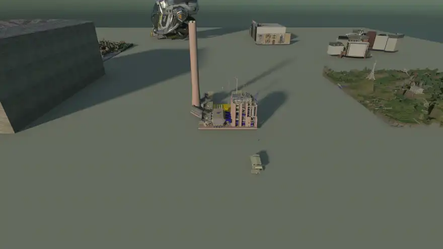

### ▶ [Watch the lap at 60 fps — 1920×804, 10-bit AV1](https://fechols.github.io/frustracer/media/tour-av1.mp4)

*A lap of the world, sunrise to moonlit night. Every frame is lit by the
always-on real-time bounce — this is the one clip on the page that is **not**
a hemisphere-GI capture, so the light filling the arcades and streets is the
same single cosine bounce per pixel a live session gets.*

*Two copies, because a README can only auto-play an image: GitHub strips
`<video>` from a rendered README, so the loop above is a 30 fps animated WebP
and the link is the real thing — the same lap at **60 fps, three times the
pixels, and a sky never quantized to 8 bits**, in fewer bytes than the loop.
(The loop's own gradients are dithered, which halves its widest visible band;
10 bits is how the video avoids the problem rather than masking it.) Rendered
with `--cinematic`; the 4K60 HDR10 master is on the
[releases page](../../releases).*

---

## THE SEVEN ISLES — one world, seven scenes, one lap of the day

The flagless boot merges every curated scene it can find into a single flat
scene under one sky, arranged as islands on a ring. The ring is **ordered by
hour**, so flying a lap sweeps the day from an industrial dawn to a moonlit
night — and flying *toward* an island eases the global clock toward that
island's own theme hour.

| # | Isle | Hour | Tris | What it is there to stress |
|---|---|---|---|---|
| 1 | **Powerplant** | 06:30 | 12.8 M | Raw geometric density — the classic worst case |
| 2 | **Sponza** | 08:30 | 0.26 M | The reference courtyard; glTF materials |
| 3 | **Rungholt** | 11:00 | 6.7 M | A whole Minecraft city on an open sea: tiny triangles, a swaying forest |
| 4 | **Damaged Helmet** | 13:00 | 15 k | All four glTF PBR map types at once |
| 5 | **San Miguel** | 15:30 | 10.0 M | Alpha-cutout foliage, glass, water, tinted shadows |
| 6 | **Bistro** | 17:30 | 2.8 M | Golden hour: 38 normal + 16 emissive maps |
| 7 | **Vokselia** | 22:00 | 1.9 M | Full night — moonlight, stars, fireflies |

<table>
<tr>
<td>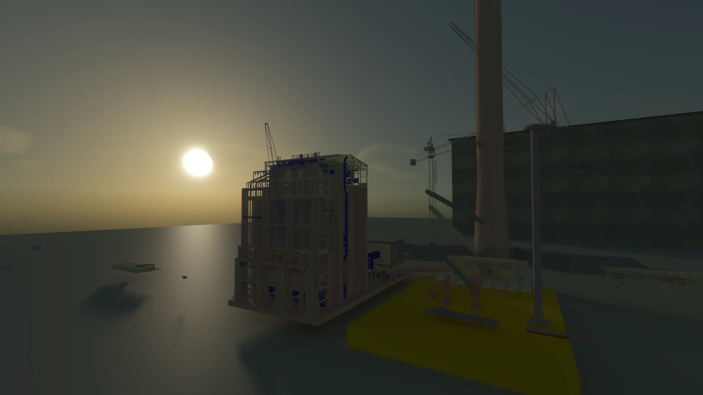</td>
<td>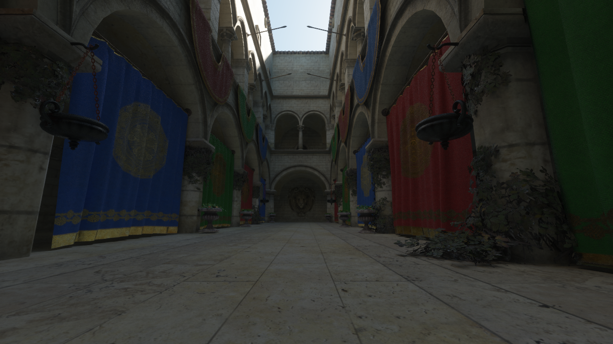</td>
</tr>
<tr>
<td>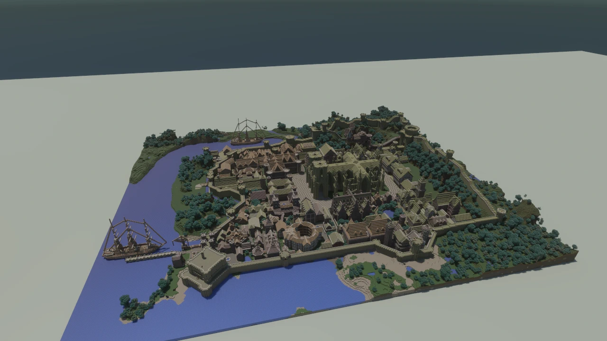</td>
<td>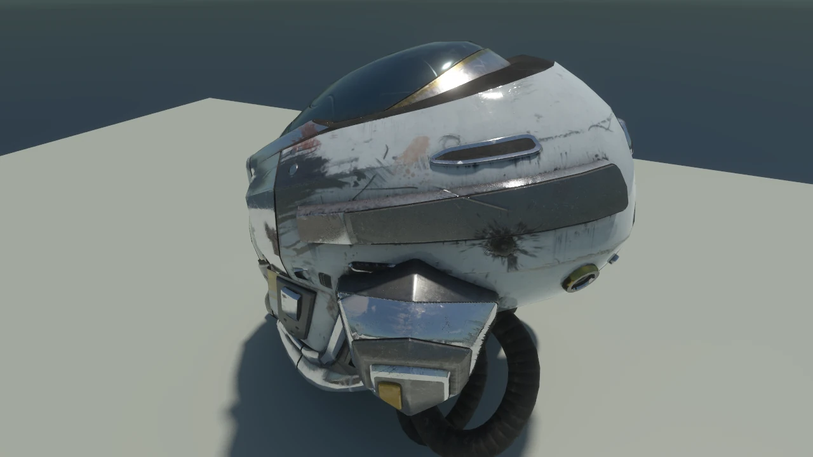</td>
</tr>
<tr>
<td>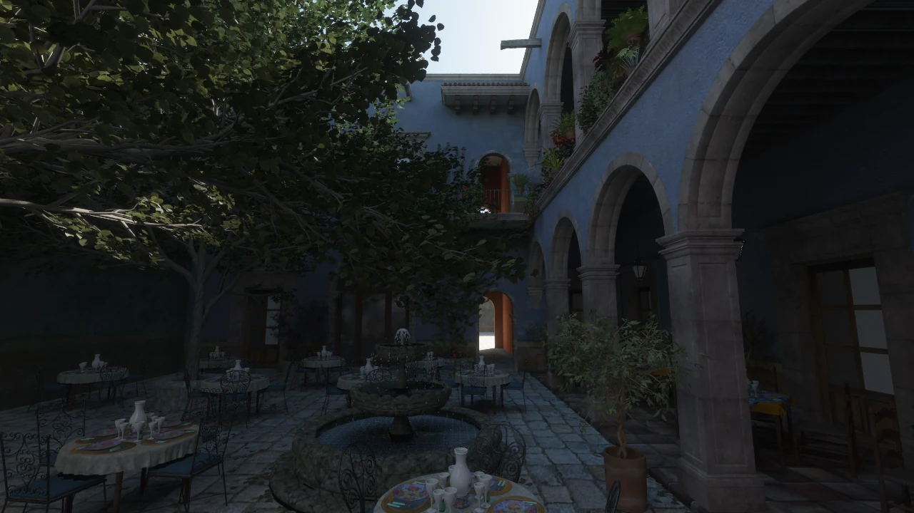</td>
<td>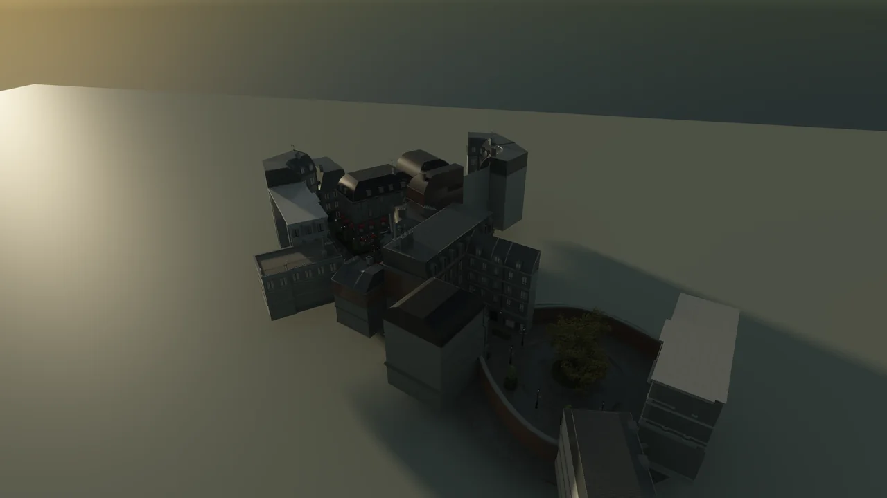</td>
</tr>
<tr>
<td colspan="2">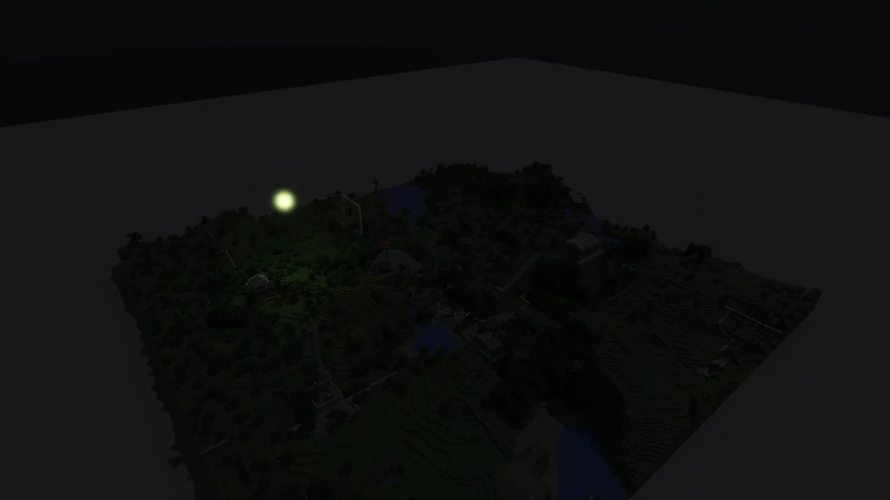</td>
</tr>
</table>

A missing scene is not an error — it prints one line and the ring is built from
whatever is on disk. A fresh checkout with no LFS data falls back to the
procedural scene and says so.

```
cargo run --release                  # the world (the default)
cargo run --release -- --no-world    # the procedural scene instead
cargo run --release -- --tod 17.5    # start at a given hour; disarms the attractors
cargo run --release -- model.obj     # or just load your own OBJ / glTF / GLB
```

---

## FLIGHT CONTROLS

| Key | Pad | Action |
|---|---|---|
| **W A S D** / arrows | left stick | fly |
| **Q** / **E** | triggers | down / up |
| hold left mouse | right stick | look |
| **Shift** / **Ctrl** | bumpers | slower (÷8 / ÷16) |
| **,** / **.** | D-pad ← → | scrub time of day (1 hour per second) |
| **Esc** | Start | pause menu (Resume / Settings / Exit) |
| **F1** | | toggle the HUD |
| **F11** | | borderless fullscreen |
| **P** | | screenshot |

An Xbox controller is fully supported: stick deflection is analog flight speed,
triggers fly down/up, the bumpers are the precision divisors, and the D-pad
scrubs time of day. Input is sampled at ~500 Hz on its own thread, so a long
frame never eats a keypress — displacement is a function of how long you held
the key, not of the framerate.

### Render modes and image quality

| Key | Action |
|---|---|
| **Space** | cycle render mode: CPU → GPU wavefront → DXR |
| **F** | jump straight between the CPU tracer and DXR |
| **G** / **K** / **X** | toggle the wired upscaler (DLSS-RR / FSR / XeSS) against plain |
| **N** / **M** | OIDN denoising; its temporal history |
| **J** | NPPD neural denoising |
| **U** | double samples per pixel (1 → 2 → … → 128 → 1) |
| **1 2 3** | quality presets |
| **H** | hemisphere bounces: off → AO → GI — the converged still-frame tiers, which take over from the always-on real-time GI while a still frame accumulates |
| **V** | heightfield relief vs plain normal mapping (`--heightfield` sessions) |

### Debug

| Key | Action |
|---|---|
| **O** | quadtree overlay — subdivision-depth heatmap + tile borders |
| **R** | hybrid frustum tracer vs plain per-pixel (the A/B) |
| **T** | dynamic resolution vs fixed half-res while moving |
| **C** | verify the current view against a reference trace |
| **B** | GPU vs CPU tonemap |
| **I** | wave-footprint overlay (GPU arms — every pixel wears its wave's ticket color; see `--waveviz` below) |
| **Y** / **Z** | freeze the view's quadtree into the scene / clear it |

---

## THE OPTIONS SCREEN — HUD, pause menu, and saved settings

**F1** raises a heads-up display: a compass, the world clock, the live render
mode, an FPS graph (the violet band is frame-generation surplus), and a keymap
panel that fades in while you fly and out a couple of seconds after you stop.
An idle screen is clean; a faded HUD costs zero repaints.

**Esc** opens a pause menu with full settings pages. While it is open the
camera is frozen and the renderer stops tracing entirely — it re-presents the
last frame, so nothing accumulates and closing the menu needs no reset.

<table>
<tr>
<td>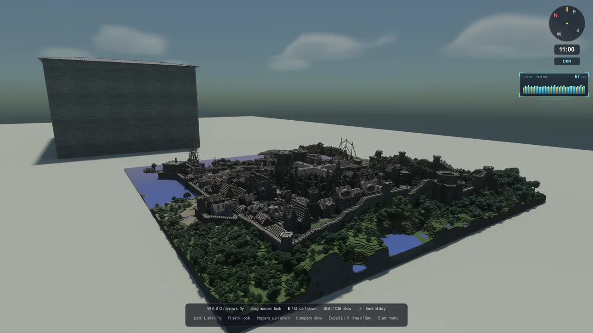</td>
<td>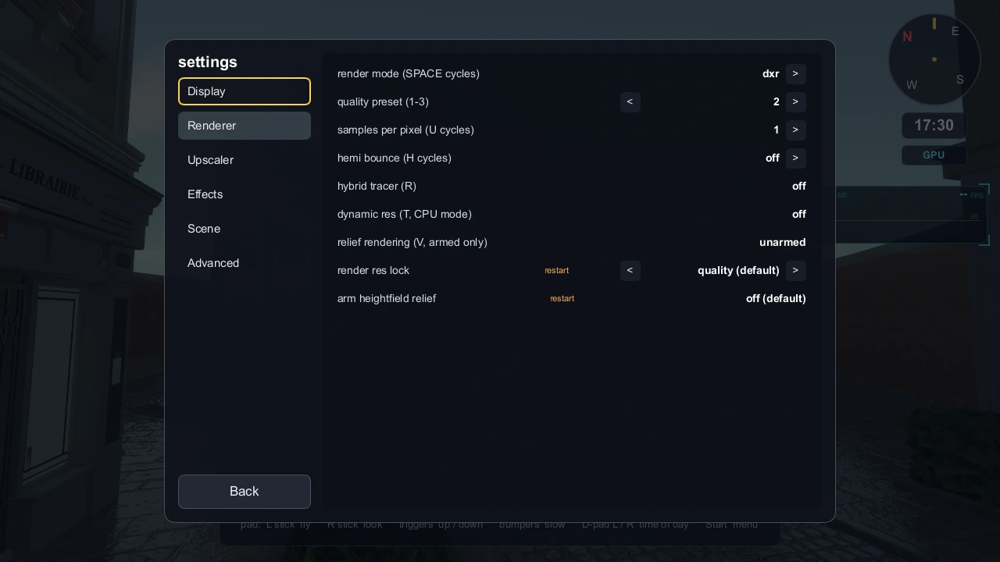</td>
</tr>
</table>

Settings are saved to `frustracer-settings.json` next to the executable. The
precedence rule is worth knowing: **compiled defaults < settings file < command
line**, by ordering alone. Live rows apply through the same code paths the
keyboard shortcuts use, so the menu and the keys can never disagree; rows that
can only be decided at startup are badged *restart*. Headless runs ignore the
file entirely — a gate has to be a pure function of its command line.

---

## POWER-UPS — what you can switch on

Everything here is on by default unless marked. Each has a kill switch, because
each one's A/B is how its cost was measured in the first place.

| Feature | Off switch | In-app |
|---|---|---|
| Real-time GI — one cosine-sampled bounce ray per pixel per frame, every render mode, with real emissive transport | `--no-rtgi` | |
| Volumetric clouds — a drifting, curl-warped slab that shadows the sun | `--no-clouds` | |
| Time of day, moon, and stars — the sun sets, the moon becomes the light, the star field lights the scene | `--tod <h>` to pin | **,** / **.** |
| Wind-swayed foliage — 7.3 M triangles moving as real geometry, with real motion vectors | `--no-foliage-sway`, `--foliage-amp <x>` | |
| Fireflies after dusk — real point lights with hard shadows | `--no-fireflies` | |
| Emissive surfaces light the scene — clustered into ≤ 64 disc lights, one tinted shadow ray each: bistro's street lamps, the helmet's visor | (opt-in `--emissive-lights [N]`; auto-armed in XeSS/FSR3 sessions, `--no-emissive-lights` vetoes) | |
| Game water — ripples off an integrable analytic height field, true refraction, tinted shadows, Beer–Lambert depth fog, aerated spray | `--no-water`, `--no-tinted-shadows`, `--no-depth-tint`, `--no-spray` | |
| Detail texturing — Unreal-1-style close-up grain, cavity AO, horizon-marched micro sun-shadows, on textured and untextured materials alike | `--no-detail-tex`, `--no-detail-ao`, `--detail-strength <k>` | |
| Surface detail that survives distance — slope-space normal-map mips, spec-AA (what a mip averages away widens the GGX lobe instead of vanishing), an amplified ambient bump response | `--no-slope-mips`, `--no-spec-aa`, `--no-amb-bump` | |
| Hemisphere-bounce GI / AO — the quadtree idea aimed at the light integral: converged still-frame tiers that take over from the real-time bounce | (opt-in) | **H** |
| Heightfield relief — real displaced geometry at the intersector | (opt-in `--heightfield`) | **V** |
| The upscaler chain — DLSS-RR → FSR4-RR → XeSS → FSR 3.1, first supported wins | `--no-upscale` | **G** / **K** / **X** |
| FRD pre-upscale denoising — the from-scratch clean-room denoiser that makes XeSS/FSR 3.1 peers of the RR engines: NRD's quality band held at 2.5× its speed, no SDK to install (`--nrd` swaps the NRD/ReBLUR oracle back in for A/B) | `--no-frd` | |
| OIDN and NPPD — the alternate denoisers: temporal-reprojected Open Image Denoise, and a neural one on ONNX Runtime / DirectML | (opt-in `--oidn` / `--nppd`) | **N** / **J** |
| Frame generation — three families, whichever the adapter supports | `--no-fg` | |
| Auto-exposure — a display-stage aperture for enclosures (San Miguel's patio sits 2–3 stops under a lit exterior) | (opt-in `--auto-exposure`; `--exposure-bias <EV>` is the manual lever) | |
| HDR output — one 10-bit swapchain: HDR10/PQ on an HDR-on display, deep-colour gamma elsewhere | `--no-hdr` | |
| Glare — the reason the sun looks like a sun | `--no-bloom` | |
| Mip chains + trilinear + 16× anisotropic filtering — one ray-cone LOD, all three renderers | `--no-mips`, `--aniso <n>` | |
| BC7 texture compression, encoded on the GPU at load | `--no-bc7` | |
| Per-island ambience + procedural wind | `--no-audio` | |

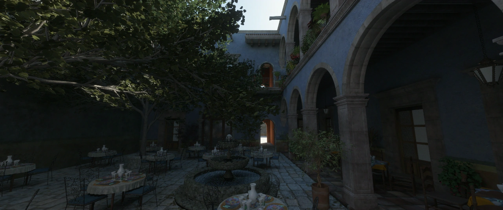

### ▶ [Watch the wind at 60 fps — 10-bit AV1](https://fechols.github.io/frustracer/media/foliage-av1.mp4)

*The loop above plays everywhere at 30 fps; the link is the 60 fps version, which
is where the individual leaves actually resolve.*

*Wind in the leaves — and the leaves are **geometry**, not a shader trick. Leaf and
bark triangles are welded and grouped into **plants** at load — 2,048 of them across
the world's seven islands — then bucketed by locality into 3,086 cells, 7.3 M
triangles in all. Each cell becomes an instance in a top-level acceleration structure
rebuilt every frame, and the ray BVH grows one **gateway** node per cell so a ray
shifts into that cell's rest space once on entry instead of paying for the
displacement per triangle. The pose is a rooted horizontal shear, so a plant bends
from its base rather than sliding, and its trunk, branches and canopy move as one
body. Because the motion lives in the structure rather than in a vertex program,
every ray sees it: swaying leaves cast swaying shadows, occlude bounce rays, and
dapple the courtyard — and it carries real motion vectors, so the temporal upscalers
see it too. All three tracers animate. `--no-foliage-sway` pins the rest pose;
`--foliage-amp 0.5` halves the wind.*

<table>
<tr>
<td>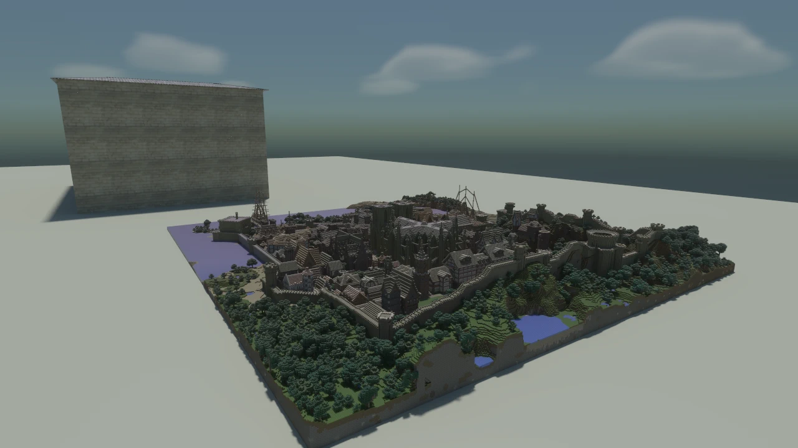<br><sub>clouds on (default)</sub></td>
<td>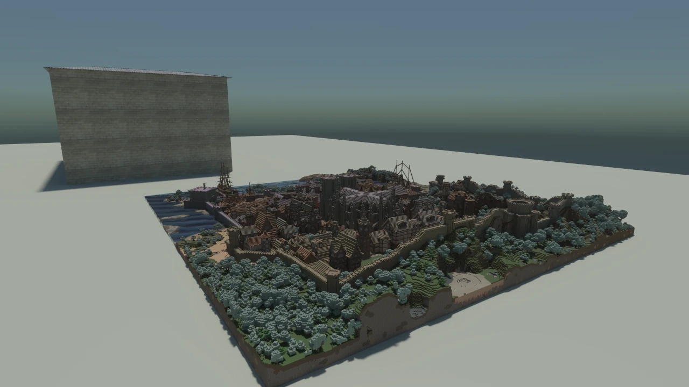<br><sub><code>--no-clouds</code></sub></td>
</tr>
</table>

<table>
<tr>
<td>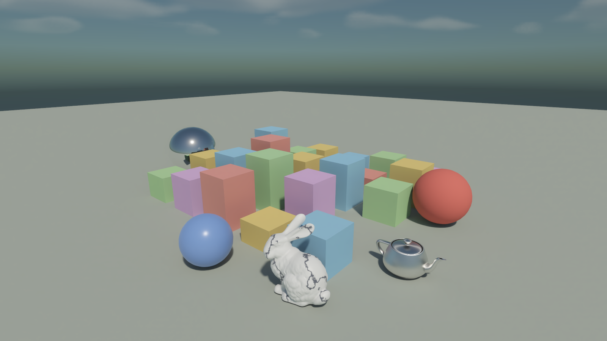<br><sub>the frame, as rendered</sub></td>
<td>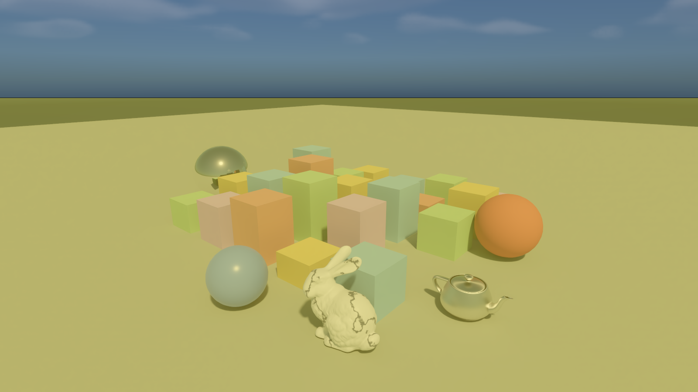<br><sub><b>O</b> — the same frame, tinted by how each tile resolved</sub></td>
</tr>
</table>

*The same pose twice, one keypress apart. The **O** overlay tints each pixel by
how its tile resolved: the blue band is sky **proven empty and traced with zero
rays**, and the warm region is where tiles reached the leaf level and fired real
ones. Side by side, the algorithm's product is legible — every blue pixel on the
right is a pixel the left one did not pay for. Shot on the procedural scene
(`--no-world`) on purpose: the world's islands all stand on one enormous ground
quad whose bounding box reaches nearly every frustum, so almost nothing is
provable as empty until deep in the tree and the overlay flattens to a single
tint. Sparse geometry against open sky is where the product is visible. (It needs
the quadtree, so it runs on the CPU or `--gpu` arm — `--dxr` traces from the TLAS
root and has no subdivision to show, which is also why both frames above pin
`--gpu`: without it, only the overlay run would switch tracers.)*

---

## THE CAMERA CREW — `--cinematic`

Every image on this page was rendered by the program itself, headlessly and
deterministically — these are the exact commands, so you can check. (The one
exception is the Arc hybrid-vs-DXR pairs further down, which are screen
captures of a live window, because the title bar's fps receipt is not in any
render target.)

```
cargo run --release -- --cinematic list                    # the shot catalogue
cargo run --release -- --cinematic hero                    # one still, seconds

# the seven isle stills, and the banner at the top of this page
cargo run --release -- --cinematic islands --cinematic-gi \
                        --cinematic-res 1280x720 --cinematic-samples 96
cargo run --release -- --cinematic hero --cinematic-island san-miguel \
                        --cinematic-gi --cinematic-res 2560x1072 \
                        --cinematic-samples 320 --cinematic-hdr

# the wind in the leaves: a locked-off clip, because a still cannot show it.
# 240 frames at 60 fps, so one render feeds both the 60 fps AV1 and, at every
# 2nd frame, the 30 fps loop
cargo run --release -- --cinematic foliage --cinematic-gi \
                        --cinematic-res 1280x536 --cinematic-samples 32 \
                        --cinematic-frames 240 --cinematic-fps 60

# the lap, as released: 4K, 60 fps, HDR10. No --cinematic-gi, so this one
# reconstructs through the upscaler chain at 100% scale — see below
cargo run --release -- --cinematic tour --cinematic-frames 1200 --cinematic-fps 60 \
                        --cinematic-res 3840x2160 --cinematic-hdr

# the clouds A/B pair — the same shot twice, one flag apart
cargo run --release -- --cinematic hero --cinematic-island rungholt --cinematic-gi \
                        --cinematic-res 1280x720 --cinematic-samples 96 [--no-clouds]

# the HUD and the pause menu, over Bistro's street
cargo run --release -- --cinematic hud --cinematic-island bistro --cinematic-gi \
                        --cinematic-res 1280x720 [--cinematic-hud settings:Renderer]

# the quadtree overlay pair, on the procedural scene. --gpu is pinned on BOTH
# arms deliberately: under the default --dxr, --cinematic-overlay alone
# promotes that ONE run to the wavefront tracer (DXR builds no quadtree to
# draw), so the pair would differ by tracer as well as by overlay
cargo run --release -- --cinematic hero --no-world --gpu [--cinematic-overlay] \
                        --cinematic-res 1600x900 --cinematic-samples 96
```

Those write PNG. The two hops that turn them into what this page actually
serves live in `tools/media-encode.py` — stills to **lossless** WebP, and the
letterboxed frame-decimated variant of the lap clip, which is *not* the encode
the program prints:

```
python3 tools/media-encode.py still \
    capture-islands/island-02-sponza-0830/island-02-sponza-0830.png \
    docs/media/islands/02-sponza.webp
python3 tools/media-encode.py tour capture-tour/tour/frames docs/media/tour.webp
python3 tools/media-encode.py av1  capture-tour/tour/frames pages/media/tour-av1.mp4 --crf 10
python3 tools/media-encode.py pages pages/media/*.mp4      # publish + verify headers
```

**Each animated shot ships twice, and the split is not redundancy.** The
committed WebP auto-loops, so the page moves the moment you open it and keeps
working offline, on a fork, and without AV1 decode; **30 fps is a floor** for
anything shipped (`cinematic::MIN_PRODUCTION_FPS` — the tour used to be 20 and
read as stuttery). The AV1 is the quality asset at 60 fps and 10-bit, and it is
delivered as a **link to GitHub Pages** — for two independent reasons, both
measured, and the second one cost a wrong commit to learn:

1. **A README cannot embed a player at all.** GitHub's README renderer strips
   `<video>` outright: fetching the live page through
   `repos/…/readme` with `Accept: application/vnd.github.html` finds zero
   `<video>` elements while the `` beside it survives. Note the trap — the
   standalone `/markdown` API is *more permissive* and happily returns the
   element with its `src`, so testing there says the opposite of what shipping
   does. A plain link is what works, which is also how
   [quinlight-audio](https://github.com/Kind-Computers/quinlight-audio) serves
   its clips.
2. **The file still has to be hosted where the bytes are playable.**
   `raw.githubusercontent.com` serves a committed file as
   `application/octet-stream` *with* `X-Content-Type-Options: nosniff`, which
   forbids the browser from decoding it, and a release asset is an `attachment`
   behind a signed URL that expires in an hour. Pages sends a real `video/mp4`
   with `Accept-Ranges: bytes` on a permanent URL, so the link opens in the
   browser's own player and seeks.

**Rendering a new video asset: supersample rather than reach for `--cinematic-gi`.**
Measured on the foliage clip at 240 frames: the hemisphere-GI accumulation path
took **2026 s**, DLSS-RR at native res took **30.5 s** but visibly softened the
leaf detail (canopy high-frequency energy −19%), and RR at **3× resolution then
downscaled** took **212 s** and came back visually comparable to GI (−11%, and
sharp where native RR was mush). RR's blur is a fixed kernel in *pixels*, so
supersampling defeats it. Reserve `--cinematic-gi` for stills, where the samples
are cheap and enclosure light is nearly all bounce.

`--cinematic` renders stills and camera-spline sequences (closed-loop
Catmull-Rom, so a lap loops seamlessly), writes a numbered PNG sequence, and
prints the exact `ffmpeg` commands to encode it — HDR10 HEVC for the release,
an animated WebP for a README. `--cinematic-hdr` adds 16-bit
PQ/Rec.2020 frames, a linear OpenEXR master, and a properly tagged HDR AVIF.

The framing for the seven isles is **authored**, not fitted, and the reason is
worth a sentence. Fitting a subject's bounding sphere from outside is right for
an object — the Damaged Helmet — and photographs the *roof* of an enclosure;
the first version of this page had Sponza, the most famous atrium in computer
graphics, as a rectangle of tiles. So `cinematic::ISLAND_FRAMING` carries a
composed eye/target/FOV per isle and anything without an entry falls through to
the sphere fit. It also carries an exposure, because an enclosure's sun is
occluded *by construction*: a physically correct patio at 15:30 sits two or
three stops under a lit exterior, which is correct and unpublishable.
`--cinematic-exposure <stops>` is that control, and it is a camera control —
brightening the sky or bending the tonemap would be a lie about the lighting,
whereas opening the aperture is what a photographer does. Zero stops is exactly
a no-op, so every capture that predates it is unchanged.

It is not just a screenshot key. Every output frame is a **static pose** rendered
as N sub-frames, and that buys two things a live session cannot have. The first is
hemisphere-bounce global illumination under a *moving camera* — the interactive
renderer can't, because that integrator is still-frames-only, and `--cinematic-gi`
is the only way to get it on a spline.

The second is the upscaler chain, which is no longer a window-only feature: the GPU
arms probe DLSS-RR → FSR4-RR → XeSS → FSR 3.1 headlessly and run the winner at
**100% render scale**, so it reconstructs rather than upscales and the frame written
out is the model's own output. Every sub-frame is a fresh jittered frame with real
motion vectors — including the foliage's — and the model integrates them, which is
what a temporal model is for. The chain flags steer it; `--no-upscale`, `--cpu`, or
an exhausted chain fall back to plain sub-frame accumulation, loudly. A **GI shot
always takes the accumulation path**, because the bounce integrator needs
accumulating stills — which is precisely what preserves the first capability. One
honest consequence: a reconstructed shot depends on which level the adapter supports
(DLSS-RR here, XeSS on Arc), so the lap above is reproducible on the same hardware
rather than universally bit-identical. Every still on this page is accumulated.

The `foliage` preset is the one shot in the catalogue that *cannot* be a still,
and it is the only one with a locked-off camera. Leaf sway is a per-frame
displacement of real geometry, so a single frame of it is indistinguishable
from the rest pose; and a moving camera would make it ambiguous, because
parallax over a static tree looks much like sway under a static camera. So it
reuses the `islands` framing verbatim and simply lets the clock run.

---

## SECRET CODES

Real flags, all of them measured rather than guessed.

| Code | Effect |
|---|---|
| `--quinlight` | Wire **every** supported upscaler at once and present the Lucas-Kanade-registered, winsorized consensus of their outputs |
| `--dxr-inline 0\|1\|2\|3` | How much of the DXR pipeline is recursive `TraceRay` vs inline `RayQuery` (3 = thin closest-hit + deferred compute shade, an unpromoted experiment). See the appendix — this one changed the default (1 cross-vendor, 2 on Intel; passing any value, `1` included, pins your choice against the vendor policy) |
| `--dxr-sbt 0\|1\|2\|3` | The material-sorted SBT ladder: 8 material classes as per-class TLAS instances into a class-major SBT — 1 = alias records (sort keys only), 2 = per-class specialized hit shaders, 3 = recursive per-class dispatch (needs `--dxr-inline 0`). See the sorted-SBT ladder section |
| `--continuation-rays` | Software prototype: beam-produced opaque traversal frontier reused by leaf rays (`--sw-rays` is the technical alias) |
| `--continuation-rays --no-cut-rays` | Direct control: same software intersector and `t_start`, but start every leaf ray at the root (and skip the terminal cut nothing there consumes) |
| `--no-temporal` \| `--no-replay` \| `--no-adopt` \| `--discard-seeds` | The temporal-reuse A/B ladder: no cross-frame reuse at all / keep seeding but re-trace static frames / keep seeding but never adopt old cuts / run the whole machinery and consume nothing — the last isolates its cost from its benefit |
| `--spin path` | The deterministic benchmark: a closed camera loop, pose a pure function of frame index |
| `--spin-hybrid`, `--spin-plain` | Select the quadtree or root-traversal arm for CPU/`--gpu` benchmarks (`--dxr` has only its DXR arm) |
| `--spin-warmup N` | Exclude leading frames; defaults to 1600 on Intel and 20 elsewhere. A *defaulted* `--spin-frames` is extended so the timed span still covers a whole 600-frame lap |
| `--cam ex,ey,ez,tx,ty,tz` | Start camera — reproducible viewpoints for benchmarks and screenshots |
| `--lock-res native\|quality\|0.75\|dynamic` | Render-resolution lock (default `native` — the wired upscaler runs DLAA-shaped) or step-wise dynamic resolution |
| `--no-vsync` | Uncapped presentation, so interactive frame times measure the renderer instead of the monitor |
| `--dual-gpu [N]` \| `--dual-gpu-auto` | Split the frame across two adapters — the secondary renders N of 8 tile rows, either pipeline on either device. Measured honestly: it **loses** interactively on this box (the second slot is electrically x4, and the band transfer costs more than the tracing it offloads), and wins 4–8% on `--cinematic` GI captures, where the band crosses once per *output* frame. The auto balancer converges its share and prints the verdict |
| `--hdr10` \| `--no-hdr10` \| `--no-hdr` | The display three-way: force PQ / force 10-bit gamma (deep-colour SDR) / legacy 8-bit. `--hdr-paper-white <nits>` sets where linear 1.0 lands; `--hdr-peak <nits>` overrides the probed display peak |
| `FR_ABL=oldcut,nobatch` | Reconstruct the pre-B70-pass wavefront queue code for a pixel-identical performance A/B |
| `FR_WIDTH=1` | Every real kernel reports its **compiled** SIMD width (`WaveGetLaneCount()` from inside the kernel — the register-pressure choice a trivial probe can't see); printed at the spin accounting line, the check suites, and the C-key verify |
| `FR_BALLAST=N` \| `dxr:N` | Inject N provably-live floats into the reference kernel, or (`dxr:N`) the identical-code mode-2 DXR raygen (image bit-identical) — sweep both to compare the compute spill knee against the RT launch regime's pricing; see the register-cliff paragraph |
| `--waveviz` \| `--waveviz chs` | Wave-footprint visualization: every wave takes a ticket, every pixel wears its wave's hash color — **I** toggles it live in GPU sessions, composited at the present funnel so it works under every upscaler; headless `--spin` runs dump `waveviz-<arm>.png` + compactness stats. `chs` tickets the mode-1 closest-hit instead (the driver's hit-stage packing, drawn). `FR_WAVEVIZ=1\|chs` is the env alias |
| `--stress 5000` | A procedural field of 5000 objects |
| `--tile 4x2` | Replicate a loaded scene into a grid — the 100-million-triangle path |
| `--bvh-builder sah\|lbvh\|ploc\|som` | Swap the BVH builder, including a self-organising-map "learned space-filling curve" (it loses) |
| `--bvh-ctrav 3 --bvh-axes 3 --bvh-maxleaf 8` | The SAH build knobs at their defaults — the memory lever, the speed lever, the leaf cap; build params key the scene cache, so sweeps never collide with a stale sidecar |
| `--el-cluster grid\|som` | Emitter-placement bake-off for the emissive-light clusterer (`som` = power-weighted batch-SOM refinement — exactly weighted Lloyd's) |
| `--fsr-max-radiance 10` (+ 5 siblings) | FSR Ray Regeneration denoiser tuning — firefly clamp, stability bias, radiance clip, disocclusion threshold, normal strength, kernel relaxation; each unset means the provider's own default |
| `--nrd-perf`, `--nrd-max-stabilized-frames 0`, … | ReBLUR performance-mode DLL + the runtime tuning family for the opt-in NRD oracle; the default FRD denoiser carries its own `--frd-*` twins |
| `--spp 16` | Samples per pixel per frame; the quadtree is traced once regardless |
| `--check`, `--check-gpu`, `--check-dxr` | The test suite (see below) |
| `--gpu-timing` | Per-pass GPU milliseconds, every vendor — the only per-pass profiler that works on Arc |
| `FRUSTRACER_STAB=1` | Print inter-frame stability of the presented image |
| `FRUSTRACER_HUD_STATS=1` | Dirty-rect accounting for the HUD, plus a ground-truth buffer dump |

### `--check` is the test suite

Twenty-six narrow Rust tests pin load-bearing shader-source invariants — mostly
ordering and monotonicity statements inside the HLSL that no CPU-only gate can
reach — and CI runs them. The main suite is still executable: `--check` renders
a frame, re-traces **every pixel** with a `tmin = 0` reference ray, and exits
nonzero unless the false-sky and tmin-overshoot counters are exactly zero — then
does it again through the depth-capped driver, the temporal cache, the replay
path, the bounce integrators, and about twenty pure-math module self-tests. It
needs no GPU and no DLLs. `--check-gpu` and `--check-dxr` carry the same
contracts onto the two D3D12 pipelines; `--check-vk` carries them onto Vulkan,
where the wavefront-vs-reference image comparison comes back at exactly zero.

---

## TROUBLESHOOTING

**`cargo build` panics before compiling anything.** It is NRD, the one required
component, and the message names the fix. Either `SDKs/NRD-src` is empty (`git
submodule update --init SDKs/NRD-src`) or the library has not been built
(`install-prerequisites.bat nrd` / `./install-prerequisites.sh nrd`). This is a
hard failure on purpose: NRD is the default denoiser, so a tree that cannot
produce it is a tree whose default session renders undenoised without saying so.

**It says "dxr: falling back to CPU tracing".** DXC is missing — run
`install-prerequisites.bat dxc`. Everything still works, just on the CPU.

**`--check-vk` says SKIP.** No Vulkan loader, no device meeting the floor
(Vulkan 1.3 + `scalarBlockLayout` + descriptor indexing), or DXC is missing —
each says which. Being *told* is different from being *absent*: a mistyped
`FR_VK_DEVICE` exits 2 rather than skipping quietly.

**The scenes are 1 KB text files.** That is git-lfs. `git lfs install`, then
`git lfs pull`.

**The world didn't load.** It prints one line per missing island. Without any
of them it falls back to the procedural scene, which is fine.

**Builds are slow.** Exclude `target/` from Windows Defender — every link
writes ~50 MB past the real-time scanner:
`Add-MpPreference -ExclusionPath '<repo>\target'`. Use `--profile quick` to
iterate (a one-line touch is ~25 s instead of ~45 s), but **never benchmark
under it** — every number this project reports assumes `release`'s LTO
settings.

**`--fsr4` exits with code 2.** That is deliberate: `--fsr4` *requires* FSR4 +
Ray Regeneration (RDNA4). It tells you why and what to try instead. Use
`--fsr` if you want it to fall through.

**It crashed.** The crash handler already wrote `frustracer-crash-<pid>.txt`
and a `.dmp` next to the executable, with one symbolized stack that crosses
the Rust/C++/vendor-DLL boundary — attach both to an issue. `--no-crash-handler`
disables it; `FR_CRASH_TEST=cpp` faults on purpose to prove the plumbing.

**A binary I built elsewhere crashes.** `.cargo/config.toml` sets
`-C target-cpu=native`. Build with `-C target-cpu=x86-64-v3` to distribute.

---

## THE FINE PRINT

**This is a non-commercial research and educational project.** It is not sold,
it carries no advertising, and nothing here is offered as a product. The
benchmark scenes under `scenes/` are redistributed for that purpose — they are
the standard research assets this kind of renderer is measured against, and
they come from archives that publish them to the research community for exactly
this use. Each scene keeps its own licence and credit file, and the required
attribution is stated there.

> **Rights holders:** if you own any asset here and would prefer it not be
> redistributed, open an issue (or email the address in the repo owner's
> profile) and it will be removed promptly, no argument. The renderer already
> degrades gracefully without any given scene — a missing island prints one
> line and the world is simply smaller.

The **source** is [MIT](LICENSE). The scenes are not: each carries its own
licence — several are non-commercial, several require attribution, two carry a
**share-alike** term, and one (`scenes/sponza-khronos/`) is a proprietary
CryEngine agreement rather than a Creative Commons one. The vendor SDKs are
downloaded from their owners rather than redistributed here. See
[LICENSE](LICENSE) for the full scope.

Scenes from the [McGuire Computer Graphics Archive](https://casual-effects.com/data/),
the [Khronos glTF sample assets](https://github.com/KhronosGroup/glTF-Sample-Assets),
and Amazon Lumberyard. Ambience is CC0. Slint is used under its Royalty-Free
licence. The Stanford bunny and the Utah teapot are where they always are.

**The two Minecraft scenes wear borrowed clothes, deliberately.** Rungholt and
Vokselia arrived as Mineways exports with Mojang's default block textures baked
into their atlases — copyrighted art whose usage guidelines do not permit
redistribution. Both atlases were rebuilt cell-for-cell from
[Pixel Perfection](https://github.com/Athemis/PixelPerfectionCE) by Hugh
"XSSheep" Rutland and contributors (CC BY-SA 4.0), on the identical layout so
the OBJ UVs never moved. The derived atlases are CC BY-SA 4.0 in turn — credit
*"Pixel Perfection by XSSheep and contributors, CC BY-SA 4.0"* and keep the
licence if you redistribute them.

**Intel Sponza is referenced but not shipped.** Several measurements in the
appendix were taken on it, and it is still supported as a scene argument — but
its terms grant personal and educational use rather than redistribution, so it
is not in this repository. Download it from
[Intel's graphics-research samples](https://www.intel.com/content/www/us/en/developer/topic-technology/graphics-research/samples.html)
and extract to `scenes/intel-sponza/` if you want to reproduce those numbers.

---
---

# TECHNICAL APPENDIX

The manual is over. What follows is the engineering write-up: how it works,
what was measured, and what was tried and removed.

## The developer's notebook

The real design document records *why* each decision was made, what was
measured, and what was tried and thrown away, and it is written for whoever, or
whatever, edits the code next. It lives in three places.

`CLAUDE.md` at the repository root is the **working contract** — about 20 KB,
and the only part loaded automatically. It carries what an editor must not get
wrong: the soundness counters that must read exactly zero, the one-sky rule, the
discipline every new feature follows, and an index of the ~220 flags.

`docs/history/` is the **campaign archive** — about 900 KB across 15 files, one
per subsystem, from `denoisers.md` through `vulkan-backend.md`. This is the
measurement record: what each number was, on which hardware, and which bug the
gate was written to catch. `docs/history/README.md` indexes it.

`CLAUDE_Historical.md` is the notebook those files were extracted from, now a
~336 KB index. Its `## Commands` block lists every flag with a pointer to the
file holding its story, and it still carries the cross-cutting sections —
`## Correctness invariants (the bug class to guard)` (the rules that must not
break) and `## Architecture notes` (the module map).

It was one 1.33 MB file until 2026-08-12. The split was mechanical and
byte-exact: reassembling the pieces reproduces the original file's checksum.

## Why a BVH for the scene?

The frustum query needs two things from the spatial structure: a cheap
"is this region outside the frustum?" test, and a cheap conservative
"nearest possible distance" bound. A **BVH of AABBs** gives both — the
classic positive-vertex plane test for culling, and point-to-box distance
for the bound. BSP/KD-trees are worse here: their splitting planes don't
yield a cheap conservative nearest-hit distance along the beam.

## The correctness crux

The distance recorded by a parent is the Euclidean distance from the camera
origin, so the region it proves empty is *frustum ∩ ball(origin, t)* — a
**spherical** bound, not a planar near clip. The query
(`src/frustum.rs::nearest_geometry_distance`) therefore culls a node as
"already proven empty" only when its whole box lies inside that ball, and
clamps candidates up to the inherited distance. Mixing in a flat near plane
would over-cull near frustum corners and let child rays start past real
geometry. Secondary rays (shadow / AO / reflection) never see the inherited
`tmin` — it is a primary-frustum property only.

The node cut obeys the same discipline: `refine_cut` may drop a node only if
it is fully outside the tile frustum or fully inside the proven-empty ball —
**never** by distance-to-best pruning (a far node can still be the nearest
thing in a sibling's frustum; pruning it would surface as false sky). When the
`MAX_CUT` budget runs out, internal nodes are emitted coarsely, never dropped.

`frustracer --check` verifies this directly: it renders one hybrid frame,
re-traces every pixel with a `tmin = 0` reference ray, and requires the
**false-sky** and **tmin-overshoot** counters to be exactly zero — at full
depth and again through the depth-capped driver (coarse flat-filled pixels are
excluded from the comparison but must exist, so the capped path is provably
exercised).

## Hemisphere bounces: the same idea, aimed at the light integral

Secondary lighting is an integral of incoming light over the hemisphere above
each shading point — and the same divide-and-conquer that drives the screen
quadtree can dispatch that search (**H** cycles it: off → AO → GI; these are
the converged still-frame tiers, which take over from the always-on real-time
GI bounce described at the end of this section).

The hemisphere is a quadtree too, but built from **spherical triangles**
instead of squares: the root is the tangent half-space (a 1-plane frustum),
level 1 is 4 spherical octants, and deeper levels split each triangle through
its great-circle edge midpoints. Great-circle edges are exactly planes through
the apex, so every cell *is* a `TileFrustum` (3 planes + unused slots), the
midpoint children exactly partition their parent (which is what makes
inherited `tmin` + node cuts sound, the same argument as pixel quadrants), and
each cell has a closed-form cosine-weighted area (Lambert's formula — an
octant is exactly π/4). The apex is the shading point; the hemisphere runs its
own tmin chain from its own apex — the primary tile's `tmin` never leaks in.

Each cell runs the familiar step: bound query over the inherited cut, then

- **proven empty** → the cell's contribution is *analytic*: exact projected
  solid angle for AO, `sky() ×` exact PSA for GI (with pure-math refinement
  near the sun's glow lobe — an empty parent proves all children empty, so
  refining costs sky evaluations only). Zero rays, zero variance.
- **query cutoff reached** → one stratified ray per sub-cell (uniform inside
  the spherical triangle, Arvo '95), seeded from the inherited cut with the
  inherited `tmin` — the hemisphere analog of `LEAF_TILE`: one bound query
  amortizes over 4 rays, because an occlusion ray is ~10 node visits and a
  bound query on a dense cut costs more.
- otherwise → refine the cut, split 4-way, recurse (blocked cells subdivide,
  never stop — same rule as the screen).

AO additionally clamps every query to the AO radius (`None` then means "open
within the radius", never "sky") and drops cut nodes entirely beyond it —
sound only because every consumer ray's `tmax` is clamped the same way.

Verification mirrors the primary gates: every claimed-empty cell is re-tested
with reference rays through its interior (**false-empty = 0**), every leaf
ray is re-traced with `tmin = 0` (**tmin-overshoot = 0**), cut-seeded
traversal must agree with the full tree, and the accounted projected solid
angle per point must total π. On top of that, `--check` A/Bs the integrator
against high-sample cosine references: AO within 0.02 mean absolute error and
bias-free (the estimator is unbiased — the leaf samples are uniform in their
cells); GI within 5% mean relative against a reference implementing the same
one-bounce policy.

The measured economics are honest rather than triumphant: a hemi-GI frame
costs ~40-60× a plain hybrid frame at 64 cells/point on the dense default
scene — but it is *converged* immediately where the sampled path needs
hundreds of accumulation frames, and open scenes adapt (most of the
hemisphere resolves analytically at octant scale).

**Real-time GI** is this machinery's other delivery, and it is the default:
instead of a whole hemisphere tree per point, every pixel of every frame runs
the integrator's *leaf policy* once — one cosine-sampled bounce ray, whose hit
shades with a shadow ray, an AO ray, and the SH sky standing in for deeper
bounces, and whose miss returns the sun-free sky gather. Cosine importance
sampling makes that single sample the irradiance estimate directly (no π to
divide by), so plain accumulation converges it on stills and the temporal
denoisers launder it at 1 spp under motion — real one-bounce GI, with real
emissive transport, in all three render modes. Measured cost: +10% on the CPU
tracer (the resolution controller absorbs it), ~+0.05 ms on a 4090,
+0.121 ms on the Arc B70. `--no-rtgi` reverts to flat SH-sky × AO ambient,
byte-identical to the pre-feature renderer; the **H** tiers, when cycled on
for a still frame, supersede the bounce rather than stack on it.

**Shadow shafts** (removed) applied the same machinery to the light: a frustum
from the shading point through the *rectangular* light's corners, subdivided
once on ambiguity, so samples landing in a subrect proven empty skipped their
occlusion ray outright — same sampling, same estimator, identical image; 75% of
shadow rays vanished on the default scene. The candid result was that at 2–4
shadow samples/point the culling query cost more than the rays it saved (~3× net
slower). It is gone now for a second reason: its whole premise was a *finite
rectangle with four corners*, and the light is a sun disc at infinity. Same
economics killed a specular-bounce cone accelerator — one query costs more than
one ray's traversal.

## The lighting model: one sky, split by frequency

The **environment** is a single light: a sky sphere at infinity, of which the
sun is a bright patch. It is *stored* in two representations, and the split is
by frequency, because the two bands need different sampling strategies:

| band | representation | sampled how |
|---|---|---|
| scattering dome (smooth — Rayleigh + Mie) | order-2 SH, 9 RGB coefficients | analytic irradiance, **zero rays** |
| sun disc (sharp) | direction + angular radius + radiance | cone-sampled, **shadow-rayed** |

This is forced, not stylistic. Spherical harmonics have **no notion of
visibility** — you cannot cast a shadow ray at a coefficient — and a 2° sun
occupies ~0.01% of the hemisphere, so gathering it by cosine sampling is pure
noise. Conversely, irradiance is a convolution of radiance with a clamped-cosine
kernel whose own spectrum collapses above l = 2, so 9 coefficients carry >99% of
what a Lambertian surface can see. Each representation is doing the job the other
physically cannot. (This is why renderers with full HDR environment maps *still*
keep an explicit sun: to importance-sample the bright region, you need it as a
separable object.)

**The invariant that keeps it honest: the sun disc is delivered exactly once per
light path.** A ray sees the disc only if no light-sampling strategy already
covers the sun along that path — the camera's own miss and refraction through
glass see it (nothing else delivers it there); every *gather* path (the
hemisphere integrator's cells, the always-on real-time GI bounce's miss, the
SH projection itself)
integrates the **sun-free dome**, because the direct-lighting loop already
delivered the sun with its own shadow ray — so the invariant holds per frame
under motion, not just on converged stills. The specular reflection ray is the one
path both strategies can reach, so it takes the dome plus a **MIS-weighted** disc
(balance heuristic; zero extra rays, zero extra random draws). Get the gather
paths wrong and you double-count the sun *and* fire fireflies into the
hemisphere's fixed-point accumulator.

It also rescues the hemisphere integrator: its empty cells are evaluated by
*centroid point-sampling*, so a cell coarser than the sun would either miss the
disc entirely or splat the whole cell at sun radiance. Excluding the disc removes
the sharp feature outright — the frequency split isn't a convenience, it's what
makes the analytic path correct.

Two later additions extend that model without weakening the invariant. After
sunset **the one disc becomes the moon** (the same `Sun` struct at the
antipodal direction, so shadows, MIS and the dome tint all keep working), and
the **star field lights the scene**: the points you see are display-only, but
the field's smooth analytic mean is delivered to every gather path, so night
has an ambient floor that does not depend on the moon's elevation. Same rule,
one representation to the eye and another to the gathers, with the energy
matched between them.

The **fireflies** are the documented exception, and they are exceptions in the
opposite direction. They are genuine point lights — up to 64 of them, windowed
`1/d²`, each with its own hard shadow ray — so the scene after dusk is no
longer lit by the environment alone. What keeps the invariant intact is that
they are excluded from *every* gather path: the SH projection, the hemisphere
cells, the GI bounce misses and both reference estimators all pass no
fireflies. Direct lighting already delivers them with a shadow ray, so a gather
that also saw them would double-count — the same argument as the sun, applied
to a local light.

**Emissive surfaces** (`--emissive-lights`) get the same treatment with the
GI rule *inverted*. At load, every emissive triangle is clustered into at most
64 disc lights, each sampled in the direct tier with one tinted shadow ray —
that is what puts pools of light under bistro's street lamps. But an emitter,
unlike a firefly, has real geometry the gather paths can *hit*, so under the
hemisphere integrator the cluster sampling drops instead of the gather: rays
that land on an emitter pick up its true textured emission with true soft
shadows, which is exact where the cluster is an approximation. And under
real-time GI the bounce's emissive pickup and the cluster sampling trade off
per frame the same way — exactly one mechanism delivers emitter-as-light per
path, ever. (XeSS/FSR 3.1 sessions arm the clusters by default: a TAA-style
neighborhood clamp rejects the bounce's sparse stochastic emissive, so those
sessions need the deterministic delivery.)

The renderer previously had *two* suns that disagreed: a soft `dot^32` glow in
the sky (a backdrop, too bright to be a light) and, separately, a 4×4 rectangular
lamp 12 units away with `1/d²` falloff that actually lit the scene. Mirrors
exposed the seam — the "sun" reflected as a **square**, because a specular
highlight is an image of the light's shape. It is a round disc now, and it is the
same sun that casts the shadows. A pleasing check: the ambient the physical
Rayleigh sky produces, (0.120, 0.176, 0.247), lands within a few percent of the
hand-tuned constant it replaced — the old guess was a good one, and it is now
*derived*.

### Glare, and why the sun is not the thing that needed fixing

Looking straight at the sun, the disc first rendered as a flat white circle
stamped on the aureole — a hard ring where the two met. The tempting fix is to
soften the sun. That would be wrong: the solar limb *is* a hard edge, a ~650×
radiance step, and the tonemap saturates above radiance ~5, so the disc lands at
a dead-flat 1.0 no matter what shape you give it.

Photographs and eyes don't show that ring, and the reason isn't the sun — it's
the **optics in between**. Light scatters in the lens, the cornea, the vitreous,
so a point source lands on the sensor as a bright core inside a wide,
heavy-tailed halo. That's what makes a sun look like a sun, and it belongs at the
display stage, not in the sky.

So `src/bloom.rs` models the scatter: a mip pyramid whose octave-spaced blurs sum
into the heavy tail a single Gaussian can't produce, folded back with a 3×3 tent
(a plain bilinear tap leaves the box kernel's *square* footprint visible in the
core — the glare comes out as a rounded rectangle, which is very obvious on the
one thing the pass exists for). The composite is **energy-conserving** —
`(1-s)·hdr + s·glare`, not `hdr + glare` — because glare *redistributes* light
rather than creating it. A uniformly lit frame must come back unchanged, which is
the gate, and it also means bloom can never be accidentally tuned into an
exposure change.

It runs on whatever image the tonemap is about to read, so it never touches
`accum`, the temporal cache, or any upscaler guide — every radiance gate in the
suite is structurally blind to it.

## Parallelism

Rayon's work-stealing pool is the "task list + pool of listener threads":
each quadrant split is a recursive `rayon::join` (small tiles recurse
sequentially for granularity). The framebuffer is a `Vec<AtomicU32>` of
f32-bit linear RGB with relaxed stores — tile writes are disjoint, so this is
the idiomatic safe shared buffer.

## Build times, and the `quick` profile

`.cargo/config.toml` links with **`rust-lld`** (LLVM's LLD in its `link.exe`-compatible
COFF mode). It ships inside the rustup toolchain, so there is nothing to install
and no new prerequisite.

(**mold is not an option on Windows** — it is an ELF linker and cannot produce a PE
binary. The question keeps coming up; `rust-lld` is the answer.)

The linker is not the bottleneck, though — the `release` profile's whole-program
LTO pass is. `release` is `lto = "thin"` + `codegen-units = 16`; the 16 was a 1
until 2026-07-23, which serialised ThinLTO into a fat-LTO-shaped single pass. A
one-line touch of `main.rs` went **198 s → 45 s** when it changed, at a measured
cost of **+1–2% CPU-tracer ms/frame** — which means CPU benchmark numbers
recorded before that date carry that offset, including some quoted below.
`[profile.quick]` (`lto = false`) takes the same touch to ~25 s.

> **Never benchmark under `quick`.** Every performance number this project reports —
> the `--check` A/B bench rows, the hemi-share kill criterion, the adopt on/off
> regression guards — is only meaningful under `release`'s `lto`/`codegen-units`
> settings. Use `quick` to find compile errors and to exercise the exact-zero
> correctness gates (which are perf-independent); use `--release` for anything that
> prints a number.

## Dynamic resolution (60 FPS target)

While the camera moves, each frame targets a time budget (~15 ms render +
resolve/present headroom ≈ 60 FPS). The budget is not a per-tile deadline:
a controller converts the *previous* frame's measured time into a **uniform
quadtree depth cap** for the next frame, and the same depth-first recursion as
the normal driver runs everywhere to that cap. Tiles reaching it unresolved
become one flat quad — the color of a single representative ray through their
center, starting at the tile's inherited distance. A uniform cap means no
screen corner gets refined at another's expense (the failure mode that a
wall-clock deadline on a depth-first traversal would have), so the recursion
keeps its cache-friendly shape: node cuts live on the recursion stack, hot in
cache, instead of a materialized breadth-first frontier of 256-byte tiles.
Zero clock reads in the driver — a frame is deterministic for a given cap.

The controller works in log space: cost roughly quadruples per level, so
`log4(budget / elapsed)` reads "levels of headroom" directly. A fractional
depth accumulator moves by `0.6 ×` that error, clamped to creep up slowly
(≤ 0.4/frame) but drop more than a full level after a blown frame, within
`[2, depth_full]`; a deadband stops it climbing when a frame already uses
> 60 % of the budget (the next level costs ~4×). At the top of the range the
cap reaches leaf tiles and a "budget" frame is simply a full hybrid frame.
The trade-off of having no in-frame deadline: a hard cut to much denser
geometry can blow one frame past budget before the controller reacts on the
next. Resolution floats with scene and shading cost instead of frame time:
crank the quality preset and tiles get coarser, not slower. The overlay tints
these depth-capped quads orange — uniform quad size is the visible signature
of the cap. When the camera stops, jittered samples accumulate (up to 1024
spp) so soft shadows, AO, and antialiasing converge at full resolution. **T**
falls back to the old fixed half-res moving mode for comparison.

Per-second stats on stderr show the frustum counters: queries, node visits
(frustum + ray), mean node-cut length, sky pixels resolved with zero rays,
coarse pixels, and mean `t_start / t_hit` (how much empty space the quadtree
skipped before each pixel ray even started).

## Deferred material-sorted shading (--defer-shade): a candid negative result

The idea: the quadtree already visits the screen depth-first, so let leaf
tiles trace their pixels but *defer* shading, merge same-material runs on the
way back up (whole-segment pointer moves, capped at a 64×64 maximum shading
tile for load balance), and flush each macro-tile with its segments
stable-sorted by material — a "tiled shader" where one material's textures
stay cache-hot for a whole burst instead of being evicted at every 8×8
boundary. The plumbing is exact: each record carries its pixel's RNG state,
`dir`/`ray` are recomputed bit-identically from the frame camera, and the
flush replays `shade()` verbatim — `--check` on any textured scene gates
defer-off vs defer-on **bit-identity** of color/t/info (0 px differ), so the
reorder provably changes nothing but timing.

Measured (7950X3D, 1080p `--spin path`, 200 frames): default procedural scene
22.7 → 22.7 ms (untextured materials shade inline — the machinery
structurally disengages), Vokselia 22.5 → 23.0, San Miguel interior 7.74 →
7.75 with 12% of pixels deferring in mean-400 px bursts, Intel Sponza (2.7 GB
of 4K textures, 23% of pixels deferring) 36.9 → **41.2 ms** — the more
texture traffic, the more the staging costs, and nowhere a win. Two earlier
implementation lessons are baked into the code: merging by `Vec::append`
re-copied every record per level (~GB/frame, 3× frame time) — segments fixed
that; and flushing a 4096-px bucket sequentially made every macro-tile an
end-of-frame straggler on one core (+29% on Sponza) — the flush now re-splits
across rayon at the fused path's 1024-px grain.

Why it can't win: at 1 spp, adjacent pixels' bilinear footprints are
essentially disjoint, so each texture cache line is touched about once per
frame *regardless of shading order* — material sorting optimizes the order of
a stream that has no reuse to exploit (and a 128 MB V-Cache absorbs much of
what little there is). Mips were the obvious suspect for creating that reuse,
so they were built next (below) and the A/B was rerun: **still no win** — San
Miguel interior 7.49 → 8.89 ms, Intel Sponza 32.6 → 38.8. Mips shrink the
*working set*, which helps the fused path just as much; they don't manufacture
inter-pixel reuse that a reorder could newly exploit. The feature stays
off-by-default behind `--defer-shade`, gates and `defer:` counters intact.
The GPU later returned the same verdict from the other side: the DXR
sorted-SBT ladder (see the DXR section) handed the hardware 8 distinct sort
keys over identical shading code and measured ~0 — there as here, ordering
a uniform workload has nothing to win, and what finally paid was compiling
per-class *thin* shaders, not sorting.

## Mip-mapping, trilinear, and 16× anisotropic filtering

Textures are sampled trilinear with a **ray-cone LOD** (Möller 2019,
curvature-free), on all three renderers — CPU, the `--gpu` wavefront, and
`--dxr`. Cone width grows along the ray (`w0 + t·spread`, primary spread = one
pixel's angular size); the LOD adds the triangle's texel density
(`0.5·log2(uv_area/world_area)`, computed on the fly from the hit's vertices —
a cached per-tri array would cost ~400 MB at 100M-tri tiling scale), the map's
dimensions, and a grazing-angle term. Reflection and glass continuations
inherit the parent hit's cone width; hemisphere-GI bounce hits read a fixed
broad footprint (over-blurred bounce albedo is variance reduction, never
error).

The chain is generated once on the CPU (2×2 box filter to 1×1) and uploaded to
the GPU verbatim, so the renderers' long-standing parity axiom is *upgraded*
rather than broken: identical texels at identical LODs, and the GPU-vs-CPU
albedo gate (mean |Δ| ≤ 0.02/channel) now compares trilinear against trilinear
— measuring 0.0000/channel on San Miguel, with no tolerance widened. Two
details are load-bearing. The filter runs in **linear space** (sRGB texels
decode, average, re-encode) — a gamma-space box filter darkens mid-tones, and
the self-test's 2×2-checker case rejects it. And **alpha cutout never sees
mips**: it stays nearest-texel at level 0 on every path, because that test is
*visibility*, and CPU/RayQuery/DXR agreeing on it bit-for-bit is a correctness
contract.

`lod ≤ 0` reproduces the old bilinear sampler bit-exactly, so magnified views
— and every existing tolerance gate — are unmoved by the feature. `--no-mips`
is the A/B lever. Measured (1080p `--spin path`, 7950X3D): mips are *faster*,
Intel Sponza 34.7 → 32.6 ms and San Miguel interior 7.7 → 7.5 (fewer
DRAM-miss taps under minification more than pays for the extra tap), at +33%
texture memory. Aliasing goes with them: `FRUSTRACER_STAB=1` on a still XeSS
Sponza view reads 0.65 → 0.57 /255 of inter-frame shimmer.

### Anisotropy (`--aniso N`, default 16)

A ray cone is a *circle*, but the surface it lands on sees an *ellipse*:
projected along the ray, the footprint is `cone_w` across the direction of
travel and `cone_w / |n·d|` along it. One scalar LOD can only describe a
circle, so the formula above covers the **major** axis and blurs the minor one
with it — its `− log2(max(|n·d|, 0.05))` term *is* that compromise, and it is
why trilinear mushes distant floors and long walls. Anisotropy is therefore not
a rival filter here but the same footprint kept honest: `tri_grads` returns both
axes as normalized-UV gradients (Cramer's rule against the triangle's UV basis
— the on-the-fly `∂P/∂u, ∂P/∂v` the normal-mapping tangent frame already
derived, now shared), the CPU averages up to 16 trilinear taps along the major
axis at the *minor* axis's LOD, and the GPU hands the identical gradients to
hardware `SampleGrad` on an anisotropic sampler. That the two paths are one
formula is gated, not asserted: on a conformal UV map the major axis in texels
must equal the old isotropic LOD to 1e-4.

Worth knowing if you go looking for this in the code: **`SampleLevel` cannot be
anisotropic.** It hands the TMU one scalar LOD and no gradients, so switching
the sampler to `ANISOTROPIC` while still calling `SampleLevel` would have been
a silent no-op — the gradients are the whole feature. Hemisphere-GI bounce rays
deliberately stay isotropic (their cone is octant-coarse by design; 16 taps
would buy nothing).

`--aniso 1` (= `--no-aniso`) runs the isotropic path *verbatim*, so it is
bit-identical to the pre-anisotropy renderer by construction — which makes the
whole check suite re-run under it the regression proof. Hardware aniso and the
CPU's N-tap approximation use different tap distributions, so they were never
going to agree exactly; the GPU-vs-CPU albedo gate measures **0.0001/channel
against its unchanged 0.02 limit**. Cost is pose-dependent and real on the CPU
(16 taps where the footprint is 16:1): Intel Sponza 24.1 → 26.3 ms (+8.7%), San
Miguel interior 16.0 → 16.1 (+1.1%); `--aniso 4|8` buys that back. On the GPU
it disappears under the bench row's own noise.

## Where DXR's time actually goes: a three-point ablation

The `--dxr` pipeline and the `--gpu` wavefront trace the same rays with the
same pasted shading code; only the dispatch shape differs — recursive
`TraceRay` through a shader binding table versus inline `RayQuery` in
compute. On an Arc Pro B70 that difference read as "DispatchRays is 5×
slower than the wavefront," which is the kind of claim that deserves a
decomposition rather than a vibe. `--dxr-inline 0|1|2` is that
decomposition: mode 1 keeps the primary
TraceRay → closest-hit but compiles the inline-RayQuery trace primitives in
place of the TraceRay flavors, so every secondary ray (shadow, AO,
reflection, the glass chain) runs inline *inside the hit shader*; mode 2
goes all-inline in raygen — no TraceRay anywhere, DispatchRays reduced to a
bare launch grid over the reference loop. Every mode passes the full
`--check-dxr` suite with statistics identical to the shipping pipeline
(same hardware traversal, same shading), so the A/B is dispatch and nothing
else.

This older campaign predates the current `(LEAF_TILE, LEAF_GROUP) = (32, 256)`
frontier and post-warm-up wall-clock harness; retain it as a dispatch-shape
ablation, not as a direct comparison to the current table below.

| Historical `--spin path` 1080p, spp=1, tracer ms | all TraceRay | inline secondaries | all inline | wavefront |
|---|---|---|---|---|
| B70 default | 9.05 | 2.35 | 1.41 | 1.76 |
| B70 `--stress 5000` | 5.30 | 1.64 | 1.22 | 2.02 |
| B70 San Miguel low-poly | 6.75 | 1.94 | 1.29 | 2.05 |
| 4090 default | 1.34 | 0.26 | 0.29 | 2.09 |
| 4090 `--stress 5000` | 0.79 | 0.25 | 0.27 | 1.08 |
| 4090 San Miguel low-poly | 1.18 | 0.34 | 0.34 | 1.00 |

**Arc executes DispatchRays and inline RayQuery just fine; what it hates is
re-entering the scheduler from a hit shader.** Recursive TraceRay
secondaries multiply the tracer 4.4–6.4× on the B70 — and this is not an
Arc quirk but a cross-vendor property: the 4090 pays 3.0–4.6× on the same
scenes. Arc's penalty is ~1.4–1.5× NVIDIA's, and it lands on top of a
weaker RT-core baseline; the two *compound* into the 5× that started the
investigation. DispatchRays launch overhead itself is ≈ zero — mode 2 lands
at the compute reference kernel's own cost on both vendors. (A later
campaign sharpened this claim — see the sorted-SBT ladder below: most of
the secondary-TraceRay bill turns out to be the fat shader hosted at every
re-entry, not the re-entry itself.)

Two riders worth keeping. The primary ray is the one place TraceRay earns
anything: on the 4090, mode 1 beats mode 2 (a coherent primary on the
hardware pipeline is worth a few percent), while the B70 always prefers
zero TraceRay. And mode 1's *marginal sample* on the B70 is 2.2 ms against
mode 2's 1.11 — the candidate-loop-fattened closest-hit shader pays
occupancy per sample where the all-TraceRay pipeline paid per dispatch, so
a fat hit shader is fine at 1 spp and ruinous at 16 (later pinned down as
spill at SIMD16, not width — see the register-cliff paragraph in "On Intel
Arc"). The spp sweep also
places the wavefront: on the B70 the all-inline DXR only beats the quadtree
below ~3 spp (the quadtree's marginal sample is 0.86 ms vs the
reference-shaped 1.11), while on the 4090 inline DXR wins at every spp
measured.

The measurement became the default: **mode 1 now ships as the DXR
pipeline's cross-vendor dispatch mode** — it strictly dominates the
all-TraceRay build at every measured (vendor, scene, spp) point while
keeping the payload / closest-hit / SBT machinery doing its real job for
the primary ray. `--dxr-inline 0` is the A/B escape back to the by-the-book
pipeline. And the Intel half of the table became a default of its own:
mode 2 beats mode 1 on the B70 at every measured point (spp=1 and the
world alike, and its per-sample marginal is half of mode 1's), so since
2026-08-01 **an Intel adapter defaults to `--dxr-inline 2`** — passing any
explicit value, `1` included, pins your choice against the vendor policy.
The numbers were the product; the defaults are the dividend.

### The sorted-SBT ladder: where the tax actually lives

The table above was measured with **one** shading record in the SBT — the
degenerate case for hardware that sorts rays by shader record (Intel's
Thread Sorting Unit), and not the way production titles feed a DXR
pipeline. `--dxr-sbt 0|1|2|3` runs the counterfactual as a ladder, each
rung isolating one mechanism. Eight field-derived material classes
partition the scene into per-class TLAS instances
(`InstanceContributionToHitGroupIndex = class × 3` into a class-major SBT;
every TraceRay call site untouched — the routing is record arithmetic).
Rung 1 keeps the one fat closest-hit and gives it 8 `ExportToRename`
aliases: identical code, distinct shader identifiers, i.e. pure sort keys.
Rung 2 compiles one specialized DXIL library per class, each class's
provably-dead shading arms stripped — thin records, real register relief
(measured, not asserted: see the register-cliff paragraph in "On Intel Arc" —
the fat kernels sit ~56–60 live floats past a 3× spill knee that thin records
duck under).
Rung 3 turns the reflection/glass continuations into real `TraceRay`s that
land in the hit surface's *own* class record (occlusion stays inline;
declared recursion depth 5) — the shape the TSU is designed around. (A
fourth dispatch mode also exists by now and appears below as a bar:
`--dxr-inline 3`, a thin closest-hit that defers shading to a compute
pass — an experiment that stays unpromoted.)

Measured on the current tree and harness (2026-08-04; minimum of two reps
run forward-then-reversed, Arc after its 1,600-frame warm-up; drivers B70
32.0.101.8805, 4090 32.0.16.1062). Frame span in ms at `--dxr-inline 0` —
the all-TraceRay pipeline, i.e. the TSU's regime — on
default / stress / San Miguel low-poly:

| rung | B70 spp=1 | B70 marginal ms/sample | 4090 spp=1 |
|---|---|---|---|
| 0 — one fat record | 8.02 / 5.31 / 6.79 | 7.02 / 4.54 / 5.92 | 1.17 / 0.83 / 1.15 |
| 1 — alias (sort keys only) | 8.60 / 5.39 / 6.67 | 7.61 / 4.64 / 5.82 | 1.18 / 0.84 / 1.16 |
| 2 — specialized | 2.51 / 2.38 / 2.17 | 1.93 / 1.74 / 1.65 | 0.25 / 0.34 / 0.24 |
| 3 — recursive per-class | **1.49 / 1.78 / 1.29** | **0.93 / 1.03 / 0.81** | 0.19 / 0.27 / 0.20 |

Four readings. **Sort keys alone bought ~0 on both vendors** — rung 1 is
flat on the B70 even with 8 genuinely distinct identifiers in flight;
sorting identical fat shaders has nothing to gain. **Specialization is the
prize** — thin per-class hit shaders recover 55–80% of the pipeline's cost
on *both* vendors, which revises the distilled claim above: the tax was
never the scheduler hop itself so much as the fat uber shader hosted at
every hop, and it largely vanishes when the records the pipeline hosts are
thin. **Recursive per-class dispatch lands the textbook pipeline at parity
with the best inline hybrids** (B70 1.49 vs the same-day inline-3's 1.40 on
the default scene, and it wins the San Miguel column; per-sample marginals
improve 5–7×) — with one confound flagged: rung 3 over rung 2 at inline 0
also moves occlusion inline, so part of its margin restates the
secondary-TraceRay finding. And **specialization stabilizes Arc codegen**:
every configuration whose repeats spread more than 15% is a fat-record one;
the specialized rows repeat tight.

The practical residue: at the shipping `--dxr-inline 1`, specializing the
one record the primary dispatches is still worth −50 to −60% on the B70
(2.22/1.72/2.44 → **1.05/0.87/0.97**), beating the same-day inline-2
(1.80/1.40/1.94) and inline-3 (1.40/1.44/2.20) bars — `--dxr-inline 1
--dxr-sbt 2` is the fastest DXR configuration measured on Arc (the 4090
gains −20 to −30% there too: 0.186/0.228/0.202), though the compute
wavefront still wins outright (0.64/0.78 recorded on default/stress). The
ladder stays a measurement lever, off by default; note that a rung-2
record's flattened loop also shades its reflected/refracted continuation
surfaces, which can belong to another class (worst measured error 9.6e-3
radiance at a glass-heavy pose — rung 3 is exact by construction, every
surface shading in its own record).

Rename semantics turned out to be vendor trivia worth recording: the NVIDIA
driver folds the 8 aliases into ONE shader identifier, the B70 mints all 8
distinct, and an AMD iGPU driver (32.0.21018.14) access-violates in
`CreateStateObject` on any renamed export.

## On Intel Arc

Most of this renderer was developed with an Arc Pro B70 in the same machine as
an RTX 4090, and running every change on both is where a surprising share of
the findings came from. These are the Arc-specific ones, with the numbers
attached. Some are properties of the hardware, some of the *driver*, and some
of the *tooling* — the distinction matters, so each one says which it is.

**The wavefront default, measured end-to-end.** An August 2026 whole-session
pass on THE WORLD read the compute-wavefront hybrid against the DXR pipeline
at four islands, each parked at its own attractor time-of-day and measured in
both render modes *in one process*, so nothing but the tracer differs: SPACE
switches arms in place. 1920×1080 window, XeSS wired at native (100%) scale,
1 spp, vsync and frame generation off, and everything the shipping Intel
session arms — real-time GI on, ReBLUR (NRD) denoising on. The figures are
the title bar's **rendered** frame rate:

| B70, THE WORLD, rendered FPS | wavefront hybrid | DXR |
|---|---:|---:|
| Sponza, 08:30 | 42 | 32 |
| San Miguel, 15:30 | 42 | 27 |
| Bistro, 17:30 | 45 | 37 |
| Rungholt, 11:00 | 89 | 57 |
| **average** | **54.50** | **38.25** |

That is the hybrid **1.2–1.6× faster at every island, ~42% on average**. The
per-pass `--gpu-timing` breakdown from the same runs says where it comes from,
and it is worth reading rather than the end-to-end column alone:

| B70, GPU ms (steady-state window) | wavefront | DXR |
|---|---:|---:|
| Sponza — tracer / frame span | 17.27 / 23.68 | 26.60 / 31.64 |
| San Miguel — tracer / frame span | 17.20 / 23.35 | 31.85 / 36.66 |
| Bistro — tracer / frame span | 16.28 / 21.90 | 22.57 / 26.81 |
| Rungholt — tracer / frame span | 5.76 / 10.99 | 13.39 / 17.20 |

**On the tracer alone the margin is wider — 1.39× to 2.33×** — and the
end-to-end figure is smaller than that because ReBLUR and XeSS add a
**fixed 3.8–5.0 ms tail that both arms pay identically** (`nrd-pack` +
`nrd` + `nrd-out` + `xess-eval`, agreeing to within 0.03 ms on every
pair). Denoising a 1-spp path-traced frame is now a real share of the
budget, so a faster tracer buys proportionally less of the whole frame than
it used to: this same comparison read 1.5–1.8× end-to-end in July, before
GI and the denoiser landed, on a tracer that was doing less work per pixel.
The tracer verdict did not weaken — the frame grew around it.

The mechanism is unchanged: `dxr-rays` re-traces every pixel from the TLAS
root each frame (11.96–30.41 ms) against the wavefront's leaf+sky, which
traces nothing for tiles it has proven empty, and on a parked frame structure
replay deletes the level ladder outright. That ladder is only ~0.2 ms at the
shipping leaf frontier, so motion cannot plausibly reverse a 5–13 ms gap even
though these particular numbers are parked. Both arms trace the *same* chunked
TLAS and pay the same ~1.4 ms foliage-sway refit. Underneath it is the
*hardware* balance — Arc's RT throughput is weak relative to its shader
cores, so rays not traced are worth more there.
Note the baseline: this is against the DXR *pipeline*, most of whose margin
is Arc running the same traversal far better as a compute kernel — for what
the quadtree itself contributes over a bare compute baseline (much less),
see "What the quadtree is actually worth" below.
These are interactive spot checks, not the deterministic `--spin` harness,
but they are what a user flying the world actually gets — and they are why
Intel adapters start in the wavefront tracer.

**This is specifically Intel Arc Pro B70 hardware; results vary — and
invert — on other GPUs.** On an RTX 4090 the same comparison prefers DXR
(see the `--dxr-inline` table above), which is exactly why the render-mode
default is vendor-keyed rather than universal.

The two tracers render the same world from the same pose; only the frame rate
differs. These are untouched lossless captures of the live window, so the
title bar carries its own receipt — and because they are two moments of a
running session rather than one frame rendered twice, the leaves are caught
mid-sway at different instants. That is the only place the pairs disagree: at
Bistro, the frame's tree canopy and hedges differ while the sky matches to
**0.0%** of pixels. Hybrid on the left, DXR on the right:

<table>
<tr>
<td>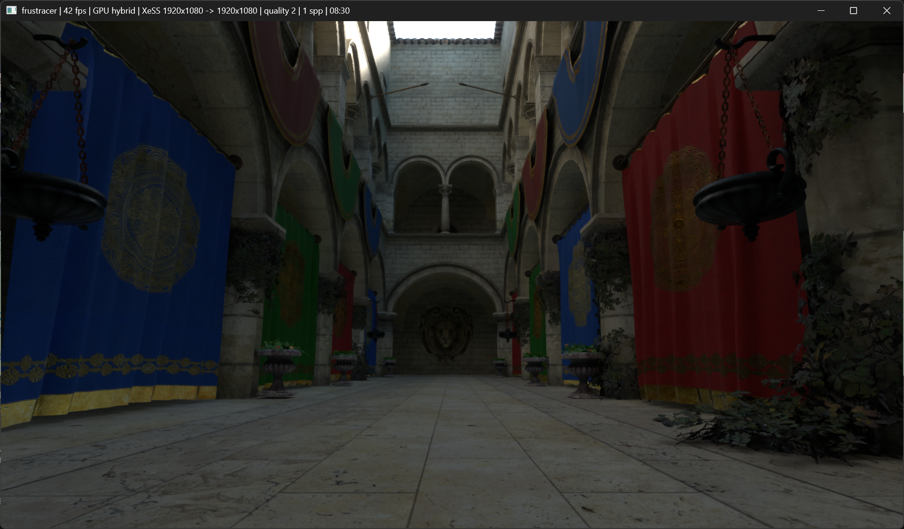<br><sub>Sponza — hybrid, <b>42 fps</b></sub></td>
<td>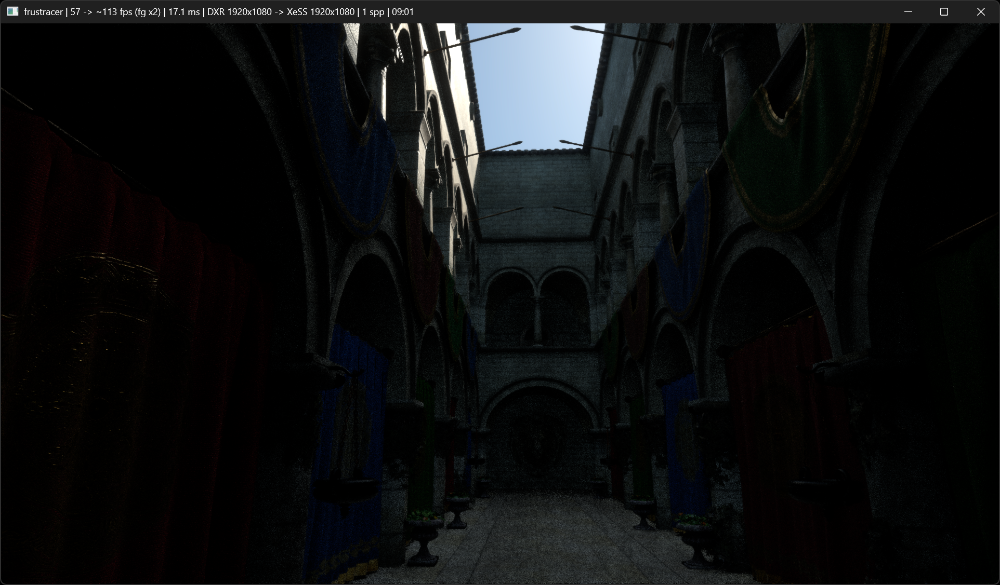<br><sub>Sponza — DXR, 32 fps</sub></td>
</tr>
<tr>
<td>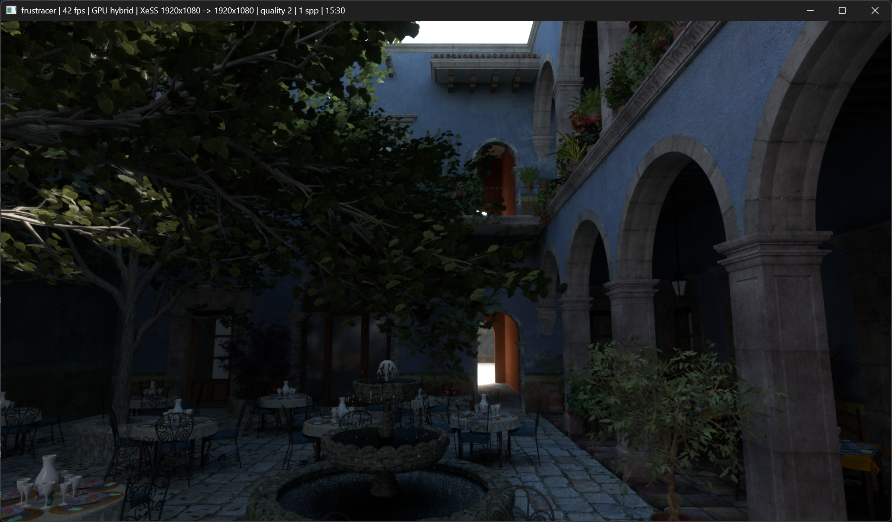<br><sub>San Miguel — hybrid, <b>42 fps</b></sub></td>
<td><br><sub>San Miguel — DXR, 27 fps</sub></td>
</tr>
<tr>
<td><br><sub>Bistro — hybrid, <b>45 fps</b></sub></td>
<td>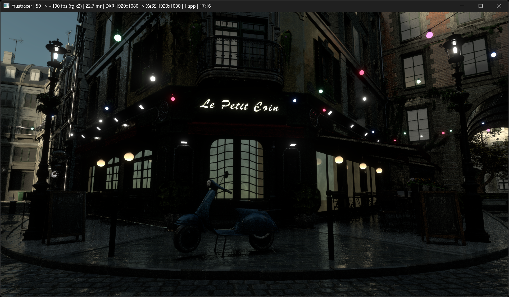<br><sub>Bistro — DXR, 37 fps</sub></td>
</tr>
<tr>
<td><br><sub>Rungholt — hybrid, <b>89 fps</b></sub></td>
<td>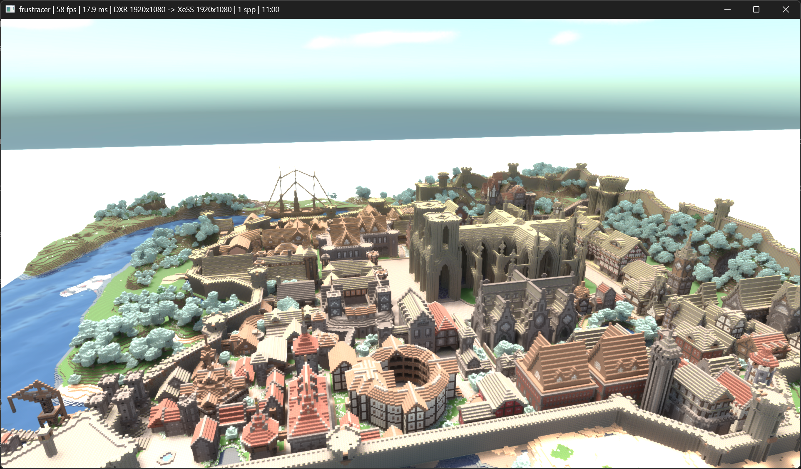<br><sub>Rungholt — DXR, 57 fps</sub></td>
</tr>
</table>

**A single large BLAS is a vendor cliff.** Acceleration-structure scratch is
sized by the largest single geometry, so THE WORLD's one 34.4-million-triangle
BLAS made the B70's driver ask for **1891 MB of scratch and then remove the
device** mid-boot (`0x887A0005`, followed by a fall back to CPU tracing and a
panic at `Present`). The same build asks an RTX 4090 for **276 MB** and
survives. Splitting the ray BVH into maximal subtrees of ≤ 64k triangles makes
the scratch a function of one chunk — 3 MB — and the session runs. That it is
BLAS *size* and nothing else is proven by `--blas-split 40000000`, which routes
one chunk through the armed path and reproduces the removal at the same
1891 MB. Compaction diverges too: 4624 → 1576 MB where NVIDIA goes
1844 → 668. This is why `--no-blas-split` is a lever and splitting is the
default — for robustness, not speed. On NVIDIA the split is performance-neutral.

**Benchmarking Arc requires a warm-up run, and the failure is silent.** The
driver compiles each new DXIL variant twice: PSO creation returns a
fast-to-produce unoptimised binary, and a background recompile replaces it on a
**wall-clock** schedule, measured at ~5–8 seconds, caching the result in
`%LOCALAPPDATA%\D3DSCache`. So a 140-frame `--spin` run — about 4 seconds —
*ends before the optimised binary lands* and is 100% fallback. Measured on a
fresh kernel variant over 1200 frames in 120-frame windows:
7.20 / 6.40 / 5.82 / 5.62 / 2.84 / 1.62 ms, then flat. That is **~4.7× on the
frame span and ~7.6× on the leaf kernel**, dead stable across the whole first
run, with the next run reading 1.5 ms off the cache. The trap is that a
fallback read *repeats*, so two agreeing back-to-back runs prove nothing. Every
point in a configuration sweep is a new variant; discard one run per variant,
and re-run any anomalous cell after a ≥ 10 second pause. The B70 then repeats
to ±0.002 ms — far tighter than the 4090, which spans 1.42–1.98 ms for one
unchanged configuration.

**PIX cannot analyse an Arc capture at all.** Its replay engine fails
`D3D12EnableExperimentalFeatures` — with Developer Mode on, and with
`--disable-gpu-plugins` — so there is no way to get numbers out of a `.wpix` on
this hardware. That is why `--gpu-timing` exists: D3D12 timestamp queries
around the same brackets the PIX markers use, vendor-neutral, and the only
per-pass GPU profiler available on Arc. Its being vendor-neutral is load-bearing
in the other direction too, because it makes a **per-pass diff between vendors**
possible, and that diff is what found the next two bugs. The compiler is even
more opaque than the capture path: Intel's own shader-dump switches
(`IGC_ShaderDumpEnable` and friends) produce zero output on driver 8805 by
every documented route — the environment variables, and both registry
locations with verified-present keys and a cache-proof fresh compile — so
per-shader ISA, GRF, and spill counts are simply unavailable on shipping
drivers. That dead end is why the in-kernel width report (`FR_WIDTH`, below)
exists: a kernel asking *itself* `WaveGetLaneCount()` is the only per-shader
compiler visibility Arc currently offers.

**The register cliff, measured from inside the shaders.** Every claim above
about "occupancy" and "register pressure" was inference from timing shapes
until two levers made it printable. `FR_WIDTH=1` has each real kernel report
its own **compiled** `WaveGetLaneCount()` — the per-shader SIMD width the
compiler actually chose, which a trivial probe kernel cannot see (it reads 32
at every group shape). The table is stark: on the B70, **every
RayQuery-carrying kernel compiles SIMD16** — the leaf, hemisphere, and
reference kernels, the deferred-shade kernel, and even the *thin* bare-hit
raygen of `--dxr-inline 3`, twenty lines that trace one ray and store 20
bytes — while the slim no-ray kernels (sky fill, tile recursion) get SIMD32
and the 4090 control reads 32 everywhere. A raygen that narrows with almost
nothing live says the RT launch regime narrows by *regime*, not just by
footprint. And since the reference and deferred-shade kernels are **both**
SIMD16, the 1.9× between them cannot be width — which leaves spill.
`FR_BALLAST=N` then locates the spill edge exactly: it injects N provably-live
floats into the reference kernel (a loop recurrence on the traced hit
distance, folded under a branch that can never run — the image is
bit-identical), and the cost curve breaks. Each live float costs ~1.5–2 µs up
to +48; between **+56 and +60** the per-float price jumps ~3× in a single
4-float step, and by +160 the kernel runs at 2.6× its baseline. So the
reference kernel's own live state sits about 56–60 floats below the
allocator's edge — and the deferred kernel behaves like the reference plus
~100 ballast floats. The strip probes complete the picture: on the deferred
kernel, removing the reflection arm saves 0.49 ms, removing the glass chain
saves 0.49 ms *on a scene with no glass*, yet removing everything saves only
0.78 — the individual savings sum to 1.22 because **cost near the cliff is a
threshold, not a per-feature sum**: shedding *either* arm's live state clears
the same spill edge. That threshold is also the best available explanation for
the build lottery (comment-level rebuilds moving a kernel 2.46 → 1.77 ms): a
kernel sitting *at* the edge tips either way on any allocation-order change,
which is why the sorted-SBT ladder found specialization *stabilizes* Arc
codegen — thin records sit safely below the cliff.

**`LEAF_GROUP = 256`, which the other two vendors would never suggest.** The
leaf kernel's group width was 32, reasoned from wave32/wave64. A 2-D sweep of
`(LEAF_TILE, LEAF_GROUP)` on the B70 put the optimum at `(32, 256)` — 1.652 →
1.291 ms on the default scene (−21.9%) and 2.009 → 1.457 on `--stress 5000`
(−27.5%) — with `LEAF_GROUP = 8` bad everywhere, which is the SIMD16 floor
showing through directly (an inference at the time; `FR_WIDTH` has since read
the leaf kernel's compiled width directly, and it is indeed 16). The pair was
adopted as the cross-vendor default: it
is worth −15% at rest and −21.6% moving on the world for the B70, and −28% to
−42% on `--spin` for the 4090. Note that the two constants must move together;
the group width alone is worth nothing.

**The `cs_sky` load-balance bug, which only a cross-vendor diff could find.**
The wavefront tracer was paying +6.9 to +9.2 ms for clouds while the DXR
pipeline paid +0.2 — for the *same* pasted march. A 30× discrepancy on shared
code can only be dispatch shape, never the shader. `cs_sky` was running one
64-lane group per sky record and grid-striding the whole rect inside it, and a
sky rect is emitted at whatever depth the quadtree proved empty, so a depth-2
rect at 1080p is 480×270 = 129,600 pixels marched by one group. The fix is
dispatch-only: **B70 8.95 → 1.56 ms** on the default scene and 13.07 → 2.81 on
stress; 4090 4.99 → 1.25 and 7.32 → 1.96. The generalisable lesson is that when
one pipeline pays for a shared shader and the other does not, suspect the
dispatch shape — and the instrument that exposes it is the per-pass timing diff
across two vendors.

**One negative result worth recording.** `--sw-rays` replaces the wavefront's
hardware `RayQuery` with this project's own BVH traversal in HLSL, which lets
leaf primaries seed from the tile's node cut — the one product of the frustum
recursion the RayQuery API cannot accept. Hardware traversal wins anyway, on
the vendor whose RT cores are weakest: B70 at 1 spp reads 1.76 ms hardware
against 2.54 software, and the cut seed recovers about 1% of that 44% gap. At
16 spp it is 13.54 against 26.35. Like the historical `--dxr-inline` table,
those absolute figures predate the current `(32, 256)` leaf frontier — the
continuation-rays ABBA near the top of this page is the same software-root
arm on the current harness, at 1.90 ms — but the verdict is the durable
part: the shared empty-space proof, not custom traversal, is what the
quadtree is actually for on a GPU.

**XeSS frame generation is verified working here**, including at HDR10: the
library's own `GetLastPresentStatus` reports two frames presented per present
with a SUCCESS generation result, and PresentMon shows ~174 presents/s over ~87
rendered. One API-shape note for anyone wiring it: the XeSS-FG proxy
*delegates* to the application's swapchain, where the AMD FidelityFX one
*consumes* it — so the app-side reference must stay alive until
`xefgSwapChainDestroy`, and releasing it early is a silent native crash.

## What the quadtree is actually worth

Worth stating plainly, because the framing invites overclaiming. This project
used to publish 0.87–0.93× Intel and 1.31–1.37× NVIDIA marginal ratios, and an
Intel crossover at about 16 spp. **Those numbers are retracted.** They were
measured at the old `(LEAF_TILE, LEAF_GROUP) = (8, 32)` frontier — the shipping
one is `(32, 256)` — and the instrumentation behind them carried uneven
asynchronous-compilation bias. What follows replaces them, measured on the
shipping build.

The current B70 harness makes the remaining gap explicit. Over one
deterministic 600-frame camera lap at 1920×1080 and 1 spp, after 1,600 warm-up
frames:

| Arm | Wall-clock ms/frame | Relative to plain |
|---|---:|---:|
| Plain hardware `RayQuery` | 0.74 | 1.00× |
| Hybrid before this B70 pass | 1.07–1.08 | 1.45–1.46× |
| Hybrid, current | 1.02–1.03 | 1.38–1.39× |

The independent in-suite, interleaved `--check-gpu` speedometer tells the same
story. These are synchronous wall-clock values; its two local warm-up frames
are not the 1,600-frame spin protocol:

| SPP | Hybrid wall ms | Plain wall ms | Hybrid / plain |
|---:|---:|---:|---:|
| 1 | 1.40 | 1.01 | 1.39× |
| 2 | 2.13 | 1.79 | 1.19× |
| 4 | 3.62 | 3.33 | 1.09× |
| 8 | 6.63 | 6.35 | 1.04× |
| 16 | 12.65 | 12.39 | 1.02× |

Its endpoint cost model (derived from spp 1 and 16) is
`0.65 + 0.750 × spp` ms for the hybrid and
`0.25 + 0.758 × spp` ms for plain traversal. The near-identical per-sample
slopes—and 0.99× asymptotic ratio—say that the current implementation nearly
amortizes its fixed front-end cost at high SPP; it does not yet recover that
cost in the measured range.

**The same sweep on an RTX 4090** (same build, same suite, a warm-up run
discarded on each adapter) gives `0.37 + 0.231 × spp` for the hybrid against
`0.13 + 0.222 × spp` for plain, a 1.03–1.04× asymptote, and 1.69× at 1 spp
falling to 1.10× at 16. Put beside the Arc row, that is the honest replacement
for the retracted table, and it is a **simpler and less flattering** result
than the one it replaces:

| | fixed ms | ms per sample | quadtree vs plain, per sample | asymptote |
|---|---:|---:|---:|---:|
| Arc Pro B70 | 0.65 vs 0.26 | 0.749 vs 0.758 | 1.2% **cheaper** | 0.99× |
| RTX 4090 | 0.37 vs 0.13 | 0.231 vs 0.223 | 3.6% dearer | 1.03× |

The old story was that the quadtree made each sample meaningfully cheaper on
Intel and dearer on NVIDIA — a genuine hardware-balance inversion. **At the
shipping frontier that inversion is gone.** The marginal sample now costs
within a few percent of hardware root traversal on both vendors, so what
separates the arms is almost entirely the fixed front-end cost the quadtree
pays once per frame and does not earn back between 1 and 16 spp. Intel still
comes out very slightly ahead, but 1.2% is not a crossover and should not be
sold as one.

One conclusion survived every ablation: tightening the inherited distance
changed ray traversal very little. Setting leaf `t_start` to zero cost only
1.1–1.7% on the measured Intel runs and straddled zero on a 4090. Most of the
useful work was **tiles proven empty tracing no rays at all**. The valuable
product is the shared empty-space proof (and, for custom traversal, the
inherited node frontier), not physical ray length.

**How this squares with the ~42% B70 world result above — the baseline is
the whole difference.** This section measures the quadtree against the
*plain compute reference* — the same RayQuery traversal in a bare compute
kernel, the cheapest arm that exists — and on THE WORLD that comparison
comes out the same way as here: at the boot pose the hybrid's trace costs
1.15 ms replayed / ~1.4 ms producing against the reference's 1.28, a ±10%
wash. The ~42% headline is measured against the **DXR pipeline**, and an
August 2026 same-day sweep decomposed the gap (the millisecond figures below
are from that sweep's build, *before* real-time GI and the denoiser landed —
read them as ratios, not against the frame times tabulated above): the *identical* full-screen
traversal costs 1.28 ms as a compute kernel, 2.59 ms as a mode-2
`DispatchRays` raygen, and 3.13 ms through the shipping mode-1 pipeline —
i.e. on Arc, with the world's fat alpha-cutout shaders, the DXR execution
model itself costs 2–2.4× over compute for the same work on the same TLAS.
(On the small procedural scene that same tax originally measured ≈ zero,
which is why it went unnoticed; that scene-gating did not survive later
builds — the tax is a driver/hardware property of hosting the kernel's live
state in the RT launch regime, and slim scenes pay it too.) The
sorted-SBT ladder later localized most of that tax to the one fat shading
record — per-class thin records dissolve the bulk of it on the spin
scenes — though the world itself ships the one-record pipeline and was not
re-measured under the ladder. An August 5 adversarial re-audit of the
DispatchRays-tax claim then tightened the numbers: the compute bracket
above was ~3% fat (it contained binds and two cache fills the DXR bracket
excluded), the bare-dispatch like-for-like world read is 1.18 vs 2.81 ms =
**2.38×**, the ratio bands 2.07–3.30× across scenes and rebuilds with the
codegen lottery living entirely in the DXR door (the compute kernel repeats
to ±0.001 ms across comment-touch rebuilds), a raygen-only state object
still pays 1.9× (the tax is the raygen's own hosting), and — a finding in
its own right — the driver spends 12–18% of a fat-scene `DispatchRays`
provisioning dead-but-exported shaders no ray can reach. So the
world margin is real end-to-end, but it is roughly nine parts "Arc prefers
this workload as compute" to one part quadtree.

## Future work

Cut-aware leaf ordering (sort the cut by distance once per leaf tile so all 64
rays shrink `tmax` early), and adapting the frame budget from measured
resolve/present cost.
